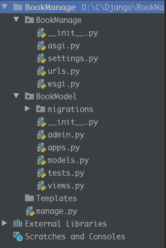

alt+F12

set global time_zone = '+8:00'

```cmd
django-admin startproject #ProjectName#
```

```cmd
django-admin startapp #BookModel#
```



指定模板路径

settings.py

```python
TEMPLATES = [
	'DIRS':[BASE_DIR+"/Templates",],
]
```

数据库配置--mysql

```python
DATABASES = {
    'default': {
        'ENGINE': 'django.db.backends.mysql',
        'NAME': '#book#',
        'USER': 'user',
        'PASSWORD': '123456',
        'HOST':'localhost',
        'PORT':'3306',
    }
}
```

修改models.py

```python
from django.db import models

class Book(models.Model):
	name = models.CharField(max_length=20)
    
```

修改setting.py

```
INSTALLED_APPS = [
    'BookModel',
]
```

命令行

```
python3 manage.py migrate
python3 manage.py makemigrations BookManage
python3 manage.py migrate BookModel
```


django-admin startapp TestModel

$ python manage.py migrate   # 创建表结构 

$ python manage.py makemigrations TestModel  # 让 Django 知道我们在我们的模型有一些变更 

$ python manage.py migrate TestModel   # 创建表结构


