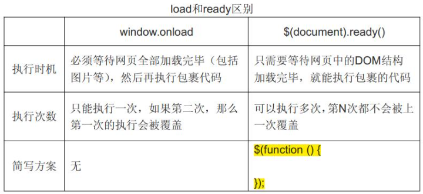
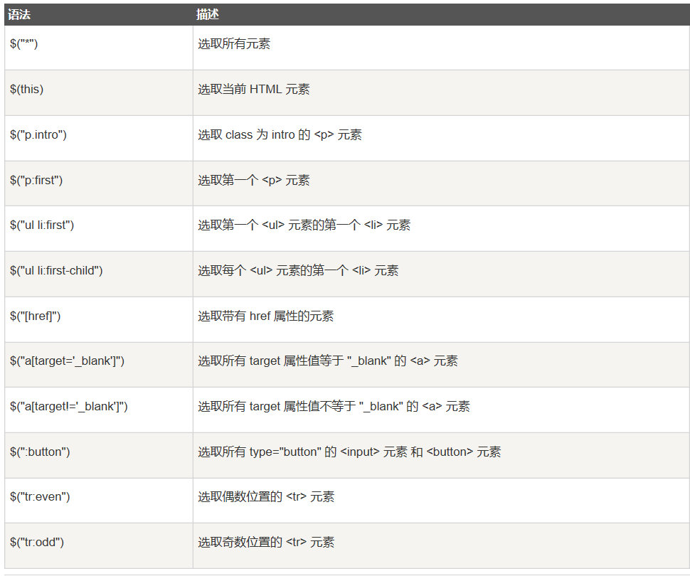

## 语法

###### 基础语法：***$(selector).action()***

补充：CSS选择器 & XPath

#### 文档就绪事件(入口函数)

在html所有标签（DOM）都加载之后执行

```jQuery
$(document).ready(function(){
    //...
})
//另一种写法
$(function(){
    //...
})
```




## 选择器

##### 元素选择器 ：基于元素名选择元素

##### #id选择器：基于HTML元素的id属性选择元素

##### .class选择器：通过指定的class查找元素



#### 独立文件中使用jQuery函数

```html
<head>
    <script src="http://..."></script>
    <script src="xx.js"></script>
</head>
```


## 事件

页面对不同访问者的相应

|      鼠标事件       | 键盘事件 | 表单事件 | 文档/窗口事件 |
| :-----------------: | :------: | :------: | :-----------: |
|   <u>click</u>()    | keypress |  submit  |     load      |
|  <u>dblclick</u>()  | keydown  |  change  |    resize     |
| <u>mouseenter</u>() |  keyup   | focus()  |    scroll     |
| <u>mouseleave</u>() |          |  blur()  |    unload     |
|       hover()       |          |          |               |

mousedown()  mouseup()

## 效果

```
隐藏&显示：
hide(speed,callback)
show(speed,callback)
toggle(speed,callback)
淡入&淡出：
fadeIn(speed,callback)
fadeOut(speed,callback)
fadeToggle(speed,callback)
fadeTo(speed,callback)
滑动：
slideDown(speed,callback)
slideUp(speed,callback)
slideToggle(speed,callback)
动画：
animate({param},speed,callback)
stop(stopAll,gotoEnd)

```

