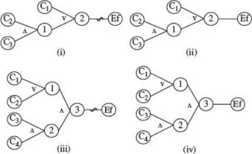
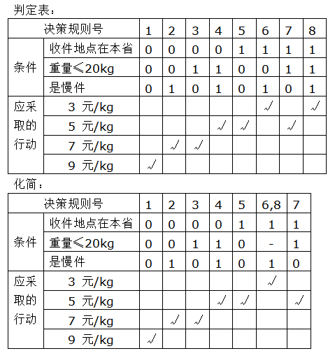

1. Consider the four cause-effect graphs in Figure 1

(a) For each graph in the figure, generate combinations of input conditions (causes) that bring Ef to 1-state. Do not apply the heuristics given in Extend reading materials

(b) Now reduce the combinations generated in (a) by applying the heuristics. How much reduction, measured in terms of the number of combinations discarded, do you achieve in each case ?

 (c) Are the combinations generated in (b) unique in the sense that another set of combinations would also be satisfactory and as small in number ?

1，考虑图1中的四个因果图

（a）对于图中的每个图形，生成使Ef变为1状态的输入条件（原因）的组合。 不要应用扩展阅读材料中给出的启发式方法

（b）现在通过应用启发式方法来减少（a）中生成的组合。 在每种情况下，根据丢弃的组合数量来衡量，减少了多少？

（c）（b）中生成的组合在另一组组合也令人满意且数量较少的意义上是否唯一？

 

| （i） |  1   |  2   |  3   |
| :---: | :--: | :--: | :--: |
|  C1   |  0   |  0   |  0   |
|  C2   |  1   |  0   |  0   |
|  C3   |  0   |  1   |  0   |
|  Ef   |  1   |  1   |  1   |

| （ii） |  1   |  2   |  3   |  4   |  5   |
| :----: | :--: | :--: | :--: | :--: | :--: |
|   C1   |  1   |  1   |  1   |  1   |  0   |
|   C2   |  1   |  0   |  0   |  1   |  1   |
|   C3   |  0   |  1   |  0   |  1   |  1   |
|   Ef   |  1   |  1   |  1   |  1   |  1   |

| （iii） |  1   |  2   |  3   |  4   |  5   |  6   |  7   |  8   |  9   |  10  |  11  |  12  |  13  |
| :-----: | :--: | :--: | :--: | :--: | :--: | :--: | :--: | :--: | :--: | :--: | :--: | :--: | :--: |
|   C1    |  0   |  0   |  0   |  0   |  0   |  0   |  0   |  1   |  1   |  1   |  1   |  1   |  1   |
|   C2    |  1   |  1   |  1   |  0   |  0   |  0   |  0   |  0   |  0   |  0   |  1   |  1   |  1   |
|   C3    |  0   |  1   |  0   |  0   |  1   |  0   |  1   |  0   |  1   |  0   |  0   |  1   |  0   |
|   C4    |  1   |  0   |  0   |  1   |  0   |  0   |  1   |  1   |  0   |  0   |  1   |  0   |  0   |
|   Ef    |  1   |  1   |  1   |  1   |  1   |  1   |  1   |  1   |  1   |  1   |  1   |  1   |  1   |

| （iv） |  1   |  2   |  3   |
| :----: | :--: | :--: | :--: |
|   C1   |  1   |  0   |  1   |
|   C2   |  1   |  1   |  0   |
|   C3   |  1   |  1   |  1   |
|   C4   |  1   |  1   |  1   |
|   Ef   |  1   |  1   |  1   |

2.某货运站收费标准如下：如果收件地点在本省，则快件每公斤5元，慢件每公斤3元；如果收件地点在省外，则在20公斤以内（含20公斤）快件每公斤7元，慢件每公斤5元，而超过20公斤时，快件每公斤9元，慢件每公斤7元。请用决策表方法解决此问题。

