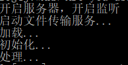
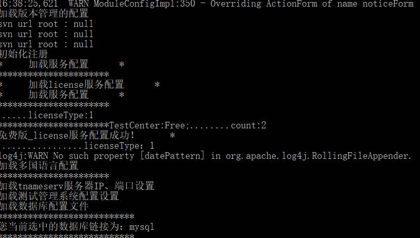
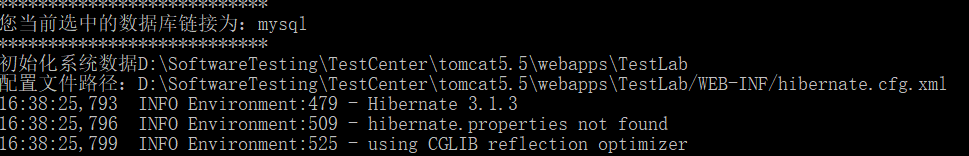
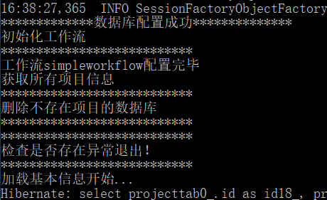
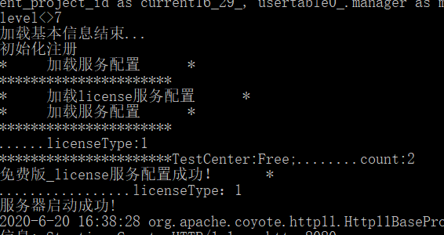

http://localhost:8080/TCLicence/TCLicence.html


管理员权限打开：

```
d:
cd D:\SoftwareTesting\TestCenter\tomcat5.5\bin
start testcenter.bat
```

登陆：

http://localhost:8080/TestLab/Admin.swf

第一次启动成功：

```

```











**4.TC的安装环境是什么？有什么要求吗？**

解答：安装TC之前必须先成功安装JDK，JDK版本最好是1.6版本的，不支持win8系统，win7、win10系统必须是超级管理员保护。 

常见问题汇总

http://www.spasvo.com/news/html/list_95_1.html

需求规格说明书

https://wenku.baidu.com/view/e8835448db38376baf1ffc4ffe4733687f21fc39.html

系统使用说明书

https://wenku.baidu.com/view/6120b4c82e3f5727a5e9629e.html

http://www.jfree.org/jfreechart/download/

https://www.dllme.com/dll/files/javaaccessbridge_dll.html

java.lang.UnsatisfiedLinkError 出现这种错误的原因是一般是java虚拟机找不到声明为native方法的本地语言定义时，出现的错误。

