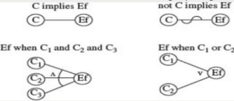

#### 常见的黑盒测试

Equivalences class partitioning 等价类划分

Boundary value analysis 边界值分析

category partitioning 类别测试（发生在系统测试阶段

Cause-effct graph 因果图

Decision table 判定表

### Equivalences class partitioning 等价类划分

Exhaustive Testing 穷尽测试 不可取

#### 类型划分

+ 有效等价类 E
  + 是否实现了规格说明中所规定的功能和性能（确认过程
+ 无效等价类 U
  + 处理异常的能力（检验过程

#### 一般流程

1.确定输入域：仔细阅读需求，并识别所有输入和输出变量，其类型以及与使用相关的任何条件。 

2.等价类划分：将每个变量的值集划分为不相交的子集。 

3.组合等价类：通常省略此步骤，并且为每个变量定义的等价类直接用于选择测试用例。 

4.确定不可测等价类：不可行等价类是包含测试期间无法生成的输入数据的组合的模型。在此步骤中，我们从E等价类中删除了包含不可行输入的等价类。 然后将所得的一组等效类用于选择测试

#### 一元划分 & 多元划分

+ 一元划分：每次只考虑一个输入变量，每个输入变量形成对输入域的一个划分
+ 多元划分：将所有输入变量的笛卡尔积是为程序的输入域I，并定义I上的关系R
+ 多元划分得到的测试用例更能充分的测试被测软件，但等价类数量会随输入变量的个数的增加而呈指数增长

+++

### Boundary value analysis 边界值分析

边界值分析法就是对输入或输出的边界值进行测试的一种黑盒测试方法。

通常边界值分析法是作为对等价类划分法的补充，这种情况下，其测试用例来自等价类的边界。

##### 常见边界值

 1）对\*16Bit的整数而言，32767和32768是边界

 2）屏幕上光标在最左上、最右下位置

 3）报表的第一行和最后一行

 4）数组元素的第一个和最后一个

 5）循环的第0次、第1次和倒数第2次、最后一次

+++

### Cause-effct graph 因果图

原因和结果之间：

原因之间的约束关系：排异`Exclusive`、包容`inclusive`、要求`requires`、唯一`one and only one`

结果之间的约束关系：屏蔽`masks`

#### 由因果图生成判定表 CEGDT

每一列都表示一个输入值的组合，即一个测试用例

条件和结果都有相对应的一行

#### 启发式的组合方法

某些类型的错误比其他的较少出现

+++

### Decision table 决策表

