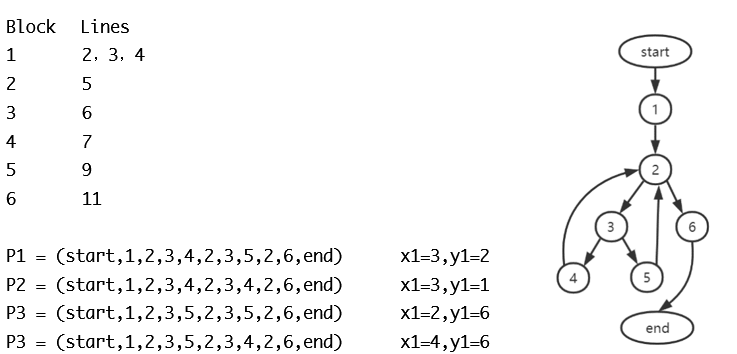

充分性评估 Adequacy assessment

逻辑覆盖准则 Logic Converage

谓词分析 Predicate Analysis

基于路径 Basis Path Testing

数据流 Data Flow Testing

DNF & CNF

Predicates Expressions -- Syntax tree representation   AST

### 控制流图 Control flow graphs CFG

基本块 Basic blocks

连续的语句序列：单入口 单出口

基本路径 Basic Paths： 线性、独立、完整的一条通路，用(e_1,e_2,…,e_k)表示

圈复杂度：V(G) = e-n+2p

#### 充分性评估 

#### 逻辑覆盖

#### 谓词分析

布尔运算符、关系运算符、算术表达式的错误（off-by-ϵ、off-by-ϵ^*^、off-by-ϵ^+^）、确实变量、变量冗余

谓词约束 Predicate constraints：BR

BOR (Boolean and Relational Operator)：布尔运算符

BRO：单/多布尔运算符，关系运算符

BRE：算术表达式的错误

