# 动态规划


##### 分治法 & 动态规划

+ 都是将问题分解为子问题，分治法的子问题是不重叠的，动态规划解决的问题都拥有重叠子问题

##### 贪心 & 动态规划

+ 

## [划分数问题](划分数问题.md)

题目：把M个同样的苹果放在N个同样的盘子里，允许有的盘子空着不放，问共有多少种不同的分法？（用K表示）5，1，1和1，5，1 是同一种分法。

+ `dp[i][j]`表示将i划分到不超过j组中的划分数，即求`dp[M][N]`

+ 状态转移方程：
  + `dp[i][j] = dp[i][j-1] + dp[i-j][j] (i > j)` 
  + `dp[i][j] = dp[i][i-1] + 1`

## [最大连续子序列和](最大连续子序列.md)

题目： 给定K个整数的序列{ N1, N2, ..., NK }，其任意连续子序列可表示为{ Ni, Ni+1, ..., Nj }，其中 1 <= i <= j <= K。最大连续子序列是所有连续子序列中元素和最大的一个，例如给定序列{ -2, 11, -4, 13, -5, -2 }，其最大连续子序列为{ 11, -4, 13 }，最大和为20。现在增加一个要求，即还需要输出该子序列的第一个和最后一个元素。

+ `dp[i]`表示以`A[i]`**作为末尾**的连续序列的最大和，即求dp[]的最大值
+ 状态转移方程：`dp[i] = max{A[i],dp[i-1] + A[i]}`

## **[最大子矩阵](最大子矩阵.md)

问题：已知矩阵的大小定义为矩阵中所有元素的和。给定一个矩阵，你的任务是找到最大的非空(大小至少是1 * 1)子矩阵。

## 最长不下降子序列（LIS）

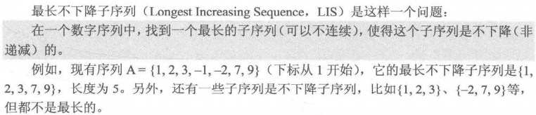

+ `dp[i]`表示以`A[i]`**结尾**的最长不下降子序列**长度**，即求dp[]的最大值
+ 两种情况：
  + 存在`A[i]`前的元素`A[j]`，满足`A[j] <= A[i]`且`dp[j] + 1 > dp[i]`，则令`dp[i] = dp[j] + 1`
  + `A[i]`前的元素都比它大，则自己形成一条子序列，长度为1，即`dp[i] = 1`
+ 边界：`dp[i] = 1 (1 <= i <= n)`

+ 状态转移方程：`dp[i] = max{1,dp[j] + 1} (j = 1,2,...,i-1 && A[j] < A[i])`

## 最长公共子序列（LCS）

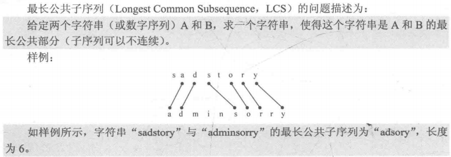

+ `dp[i][j]`表示字符串A的i号位和字符串B的j号位之前的LCS长度
+ 根据`A[i]` 和`B[j]`的情况，分为两种决策：
  + `A[i] == B[j]`，有`dp[i][j] = dp[i-1][j-1] + 1`
  + `A[i] != B[j]`，有`dp[i][j] = max{dp[i][j-1], dp[i-1][j]}`

## 最长回文子串

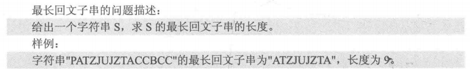

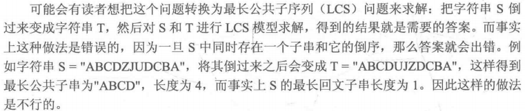

+ 子串要求连续
+ `dp[i][j]`表示`S[i] ~ S[j]`表示的子串是否是回文的
+ 根据`S[i]`和`S[j]`是否相同可以分为两种情况：
  + `S[i] == S[j]`，`dp[i][j] = S[i-1][j-1]`
  + `S[i] != S[j]`，`dp[i][j] = false`

+ 边界：`dp[i][i] = 1, dp[i][i+1] = (S[i] == S[i+1])`

+ 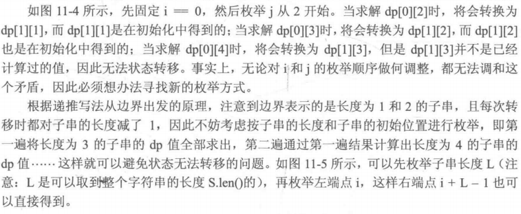

## **DAG最长路

+ DAG：有向无环图
+ `dp[i]`表示从i号顶点出发能获得的最长路径长度，即求`dp[]`的最大值

+ 状态转移方程：如果从i号顶点出发能直接到达顶点 j~1~, j~2~, ... ,j~k~，而dp[j~1~]，dp[j~k~] 均已知，那么就有`dp[i] = max{dp[j] + length[i->j]}`

  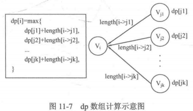

+ 需要使用递归计算dp数组

  ```c++
  int DP(int i){
      if(dp[i] > 0) return dp[i]; // dp[i]已计算得到
      for(int j = 0; j < n;j++){  // 遍历i所有出边
          if(G[i][j] != INF){
              dp[i] = max(dp[i],DP(j) + G[i][j]);
          }
      }
      return dp[i];
  }
  ```


## 背包问题

#### 多阶段动态规划问题

+ 问题可以描述成若干个有序的阶段，每个阶段的状态只和上一个阶段的状态有关。

#### 01背包问题

问题：有n件物品，每件物品的重量为w[i]，价值为c[i]。现有一个容量为V的背包，问如何选取物品放入背包，使得背包内物品的总价值最大。其中每种物品都只有一件。

+ 令`dp[i][v]`表示前i件物品恰好装入容量为v的背包中能获得的最大价值。

+ 两种情况：
  + 不放第i件物品：`dp[i][v] = dp[i-1][v]`
  + 放第i件物品：`dp[i][v] = dp[i-1][v-w] + c[i]`
+ 状态转移方程：`dp[i][v] = max{dp[i-1][v],dp[i-1][v-w[i]] + c[i]}`

+ 边界：`dp[0][v] = 0`

##### 滚动数组

+ 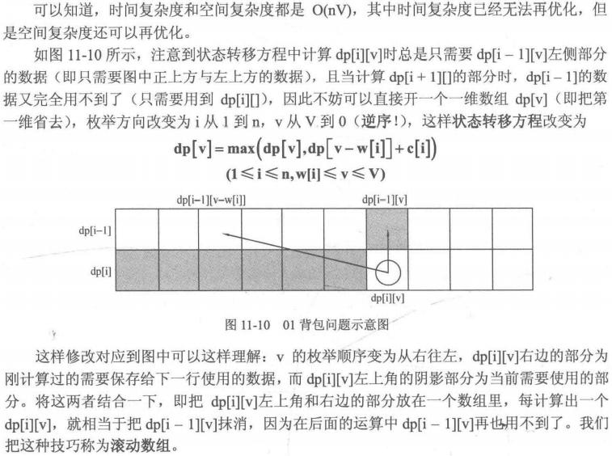

**思想：**


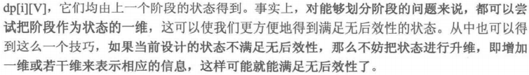

#### 完全背包问题

问题：有n种物品，每种物品的单件重量为`w[i]`，价值为`c[i]`。现有一个容量为V的背包，问如何选取物品放入背包，使得背包内物品的总价值最大。**每件物品有无穷件。**

+ 令`dp[i][v]`表示前i件物品恰好装入容量为v的背包中能获得的最大价值。

+ 两种情况：

  + 不放第i件物品：`dp[i][v] = dp[i-1][v]`
  + 放第i件物品：`dp[i][v] = dp[i][v-w[i]] + c[i]`，物品没有数量限制，所以可以放任意件，直到第二维的`v-w[i] < 0`

+ 状态转移方程：`dp[i][v] = max{dp[i-1][v],dp[i][v-w[i]] + c[i]}`

  可以改写为一维式：`dp[v] = max(dp[v],dp[v-w[i]] + c[i])`，与01背包完全相同，但这里的v的枚举顺序是**正向枚举**。

+ 边界：`dp[0][v] = 0`

## 总结

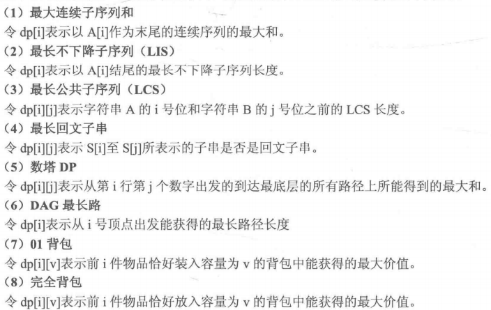

+ 子序列可以不连续，子串必须连续
+ 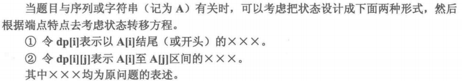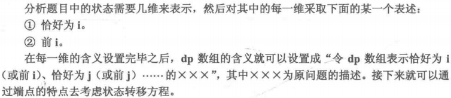

+ 