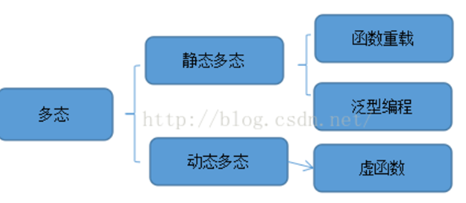

# [目标和](https://leetcode-cn.com/problems/target-sum)

## 题目

给定一个非负整数数组，a1, a2, ..., an, 和一个目标数，S。现在你有两个符号 + 和 -。对于数组中的任意一个整数，你都可以从 + 或 -中选择一个符号添加在前面。

返回可以使最终数组和为目标数 S 的所有添加符号的方法数。

```
输入：nums: [1, 1, 1, 1, 1], S: 3
输出：5
解释：

-1+1+1+1+1 = 3
+1-1+1+1+1 = 3
+1+1-1+1+1 = 3
+1+1+1-1+1 = 3
+1+1+1+1-1 = 3

一共有5种方法让最终目标和为3。
```


提示：

1. 数组非空，且长度不会超过 20 。
2. 初始的数组的和不会超过 1000 。
3. 保证返回的最终结果能被 32 位整数存下。

## 回溯法

相当于是二叉树的遍历

```c++
#include <iostream>
#include <vector>
using namespace std;

void BFS(vector<int>& nums, int S, int pos, int& count, int sumNow) {
	if (pos == nums.size()) {
		if (sumNow == S) count++;
		return;
	}

	BFS(nums, S, pos + 1, count, sumNow + nums.at(pos));
	BFS(nums, S, pos + 1, count, sumNow - nums.at(pos));
}

int findTargetSumWays(vector<int>& nums, int S) {
	int count = 0;
	BFS(nums, S, 0, count,0);
	return count;
}

int main() {
	vector<int> nums;
	int n;
	do {
		cin >> n;
		nums.push_back(n);
		
	} while (getchar() != '\n');
	cin >> n;
	cout << findTargetSumWays(nums, n);
}

```

## 动态规划

背包问题

#### 状态

将`dp[i][j]`定义为从数组nums中 0 ~ i 的元素进行加减可以得到 j 的方法数量。

#### 状态转移方程

`dp[i][j] = dp[i-1][j-nums[i]] + dp[i-1][j+nums[i]]`

#### 初始化

nums[0]可能等于0，这样初始化dp数组第一行的时候很可能踩坑，因为如果nums[0]==0那么`dp[0][sum]`需要初始化为2，因为加减0都得0。 