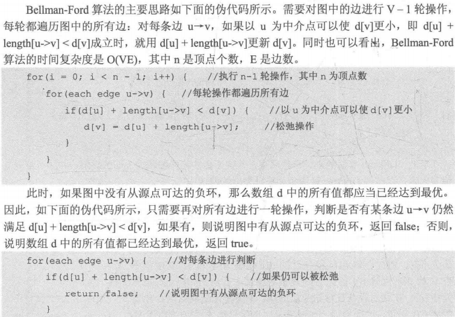
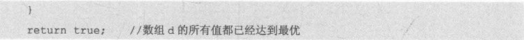

# 图

#### 欧拉回路

**无向图存在欧拉回路的充要条件**

一个无向图存在欧拉回路，当且仅当该图所有顶点度数都为偶数,且该图是连通图。

**有向图存在欧拉回路的充要条件**

一个有向图存在欧拉回路，所有顶点的入度等于出度且该图是连通图。

## 存储

#### 邻接表

```c++
vector<int> Adj[N]; // 不存放边权
vector<Node> Adj[N];

// 插入一条边
// 邻接表存放顶点的出边
// 添加i->j
Adj[i].push_back[j];
```

## 遍历

#### DFS


```c++
const int MAXV = 1000 //最大顶点数
const int INF = 100000000000; // 一个很大的数

void DFSTrave(){
    for(int u = 0;u < n;u++){
        if(!visit[u]) DFS(u,1);
    }
}
```

+ **邻接矩阵存储**

```c++
int n,G[MAXV][MAXV];
bool visit[MAXV] = {false};

void DFS(int u,int depth){
	visit[u] = true;
    // 对u的操作...
    for(int v = 0;v < n;v++){
        if(!visit[v] && G[u][v] != INF){ // u可达v
            DFS(v,depth + 1);
        }
    }
}
```

+ **邻接表存储**

```c++
vector<int> Adj[MAXV];
int n;
bool visit[MAXV] = {false};
void DFS(int u,int depth){
    visit[u] = true;
    for(int i = 0;i < Adj[u].size();i++){
        int v = Adj[u][i];
        if(!visit[v]) DFS(v,depth + 1);
    }
}
```

#### BFS


## 最短路径

#### Dijkstra算法

```c++
int N, G[MAXV][MAXV]; // N-顶点数
int d[MAXV]; // 起点到达各点的最短路径
bool vis[MAXV] = {false} // 标记数组

void Dijkstra(int s){ // s为起点
	// 初始化 INF - 0x7fffffff
    fill(d, d + MAXV, INF);
    d[s] = 0; // 到自身的距离为0
    for(int i = 0;i < n;i++){
        // 找到距离s最近的节点 即d[s]的最小值
        int u = -1, MIN = INF;
        for(int j = 0;j < N;j++){
            if(!vis[j] && d[j] < MIN){
                u = j;
                MIN = d[j];
            }
        }
        // 找不到小于INF的d[u],说明剩下的顶点和起点s不连通
        if(u == -1) break; // return;
    	vis[u] = true; // 标记u已访问
        // ****邻接表/邻接矩阵****
        // ...
    }
}
```

+ **邻接表**

  ```c++
  for(int j = 0;j < Adj[u].size();j++){
      int v = Adj[u][j].v; // 通过邻接表直接获得u能到达的顶点v
      if(!vis[v] && d[u] + Adj[u][j].dis < d[v]){
          // 优化
          d[v] = d[u] + Adj[u][j].dis;
      }
  }
  ```

+ **邻接矩阵**

  ```c++
  for(int v = 0; v < n; v++){
  	if(!vis[u] && G[u][v] != INF && d[u] + G[u][v] < d[v]){
          d[v] = d[u] + G[u][v];
      }
  }
  ```

+ 时间复杂度为`O(V^)`，且只应用于边权没有负数
+ 例题：[I Wanna Go HOME](I Wanna Go Home.md)

#### Bellman-Ford算法

+ 最短路径肯定是一个不包含回路的简单路径。
+ Bellman-Ford的松弛操作不会超过V-1轮

+ 

  

+ 需要遍历所有边，采用邻接表

+ ```c++
  struct Node{
  	int v,dis;
  };
  
  vector<Node> Adj[MAXV];
  int N;
  int d[MAXV];
  ```

  ```c++
  bool Bellman(int s){
  	fill(d, d + MAXV, INF);
      d[s] = 0;
      // 求解数组d
      for(int i = 0;i < n - 1;i++){
          for(int u = 0;u < n;u++){ // 遍历所有边
              for(int j = 0; i < Ad[j].size();j++){
                  int v = Adj[u][j].v;  // 邻接边的顶点
                  int dis = Adj[u][j].dis; // 邻接边的边权
                  if(d[u] + dis < d[v]){  // 以u为中介点可以使d[v]更小
                      d[v] = d[u] + dis;  // 松弛操作
                  }
              }
          }
      }
      // 判断负环的代码
      for(int u = 0; u < n;u++){
          for(int j = 0;j < Adj[u].size();j++){
               int v = Adj[u][j].v;  // 邻接边的顶点
               int dis = Adj[u][j].dis; // 邻接边的边权
               if(d[u] + dis < d[v]){  // 以u为中介点可以使d[v]更小
                   return false; // 有源点可达的负环
               }
          }
      }
      return true; // 数组d的所有值都已经达到最优
  }
  ```

+ 时间复杂度：`O(VE)`

#### SPFA算法

只有当某个顶点u的d[u]值改变时，从它出发的边的邻接点v的d[v]值才有可能被改变。


+ 时间复杂度：`O(kE)`，在很多情况下k不超过2

++++

#### Floyd算法

```
枚举顶点k∈[1,n]:
	以顶点k作为中介点，枚举所有顶点对(i,j):
		如果dis[i][k] + dis[k][j] < dis[i][j]成立
			赋值dis[i][j] = dis[i][k] + dis[k][j]
```

`dis[i][j]`表示顶点i和顶点j的最短距离

## 最小生成树


#### 	Kruskal算法

```c++
int Kruskal(){
	将所有边按边权从小到大排序
	for(从小到大枚举所有边){
		if(当前边的两个端点在不同连接块中){
			将该边加入最小生成树
			总边权增加
			总边数增加
			if(总边数 == 顶点数-1) break;
		}
	}
	return 总边权
}
```

例题：[Freckles](Freckles.md)

#### Prim算法

```
Prim(G,d[]){
	初始化
	for(循环n次){
		u = 使d[u]最小的还未被访问的顶点的标号
		vis[u] = true;
		for(从u出发能到达的所有顶点v){
			if(!vis[v] && 以u为中介点使得v与集合S的最短距离d[v]更优){
				将G[u][v]赋值给v与集合S的最短距离d[v];
			}
		}
	}
}
```

## 关键路径

AOV网：顶点表示活动，边集表示活动间优先关系的有向图

AOE网：带权的边集表示活动，顶点表示事件的有向图

都是有向无环图

