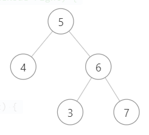

# 判断BST的合法性

#### 我的代码

```java
/**
 * Definition for a binary tree node.
 * public class TreeNode {
 *     int val;
 *     TreeNode left;
 *     TreeNode right;
 *     TreeNode() {}
 *     TreeNode(int val) { this.val = val; }
 *     TreeNode(int val, TreeNode left, TreeNode right) {
 *         this.val = val;
 *         this.left = left;
 *         this.right = right;
 *     }
 * }
 */
class Solution {
    public boolean isValidBST(TreeNode root) {

        if(root.left == null){
            if(root.right == null) return true;
            if(root.right.val > root.val) return isValidBST(root.right);
            return false;
        }
        else{
            if(root.left.val >= root.val) return false;
            if(root.right == null ) return isValidBST(root.left);
            if(root.right.val > root.val) return isValidBST(root.left) && isValidBST(root.right);
        }
        return false;
    }
}
```

判断结果不正确（3不正确，要确保右子树的所有节点都大于当前节点）




正确代码：

```
boolean isValidBST(TreeNode root) {
    return isValidBST(root, null, null);
}

/* 限定以 root 为根的子树节点必须满足 max.val > root.val > min.val */
boolean isValidBST(TreeNode root, TreeNode min, TreeNode max) {
    // base case
    if (root == null) return true;
    // 若 root.val 不符合 max 和 min 的限制，说明不是合法 BST
    if (min != null && root.val <= min.val) return false;
    if (max != null && root.val >= max.val) return false;
    // 限定左子树的最大值是 root.val，右子树的最小值是 root.val
    return isValidBST(root.left, min, root) 
        && isValidBST(root.right, root, max);
}
```


# [缀点成线](https://leetcode-cn.com/problems/check-if-it-is-a-straight-line)

在一个 XY 坐标系中有一些点，我们用数组 coordinates 来分别记录它们的坐标，其中 coordinates[i] = [x, y] 表示横坐标为 x、纵坐标为 y 的点。

请你来判断，这些点是否在该坐标系中属于同一条直线上，是则返回 true，否则请返回 false。

**尽量不要用判断斜率是否相等，可以利用共线向量线性相关**

```c++
bool checkStraightLine(vector<vector<int>>& coordinates) {
        int n = coordinates.size();
        int x0 = coordinates[0][0], y0 = coordinates[0][1];
        int x = coordinates[1][0] - x0;
        int y = coordinates[1][1] - y0;
        for (int i = 2; i < n; ++i) {
            int xi = coordinates[i][0] - x0;
            int yi = coordinates[i][1] - y0;
            if (x * yi - y * xi) { //计算二阶行列式
                return false;
            }
        }
        return true;
    }
```

