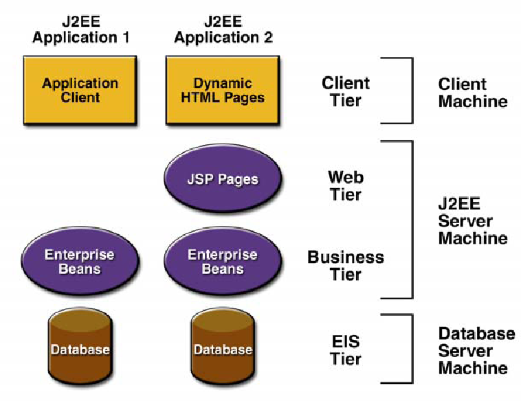
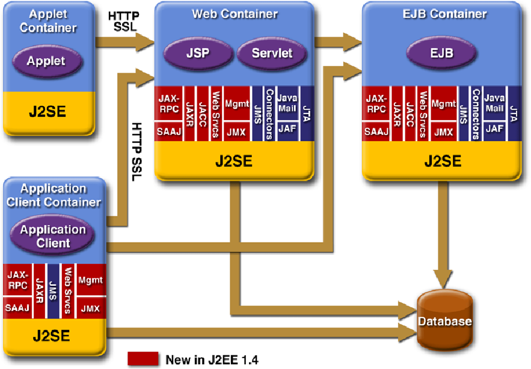
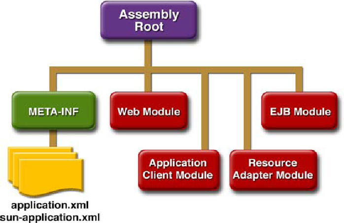

#### 内容

J2EE导论，应用服务器（应用容器，GlassFish，JBoss），WEB容器，EJB容器，会话组件（表示逻辑层，有/无状态），跨容器注入机制。

#### 问题

###### 什么是J2EE容器？与EJB容器的关系是什么？试列举至少两种J2EE容器。

GlassFish、JBoss

###### 什么是无状态会话Bean？什么是有状态会话Bean? 什么是实体Bean？它们的区别是什么？

会话组件代表逻辑层，实体组件代表数据层

###### 什么是EJB的注入机制？

在web容器里面生成的jsp网页和服务器端小程序(applets?，跨容器的生成一个会话组件实例，就像本身的成员一样使用

###### 什么是SSSB的管理池？(pooling Sateless Session Beans)

在EJB容器里创建的无状态会话组件，在生命周期内，放在内存管理池（表格）里面，等待下一次来自客户端的请求，避免了重复创建

###### 什么是EJB的Java Persistence技术？

支撑通过实体组件对后台数据库的操作的技术。这种操作是实时的，原子的。java持久化技术

###### POJO plain old Java object

在通常的java类中加上一些标注，从而让EJB容器来完成一些工作，把普通的java对象升级成POJO对象。 

###### 试说明以下EJB Java标注的意义：@Remote, @Stateless, @Stateful, @Entity, @EJB, @Id, @Column, @PersistenceContext, @Table, @NamedQuery。


|        标注         |       意义       |
| :-----------------: | :--------------: |
|       @Remote       | 定义一个远程接口 |
|     @Stateless      |  无状态会话组件  |
|      @Stateful      |  有状态会话组件  |
|       @Entity       |      实体类      |
|        @EJB         |     注入体制     |
|         @Id         |                  |
|       @Column       |     字段、列     |
| @PresistenceContext |                  |
|       @Table        |       表单       |
|     @NameQuery      |                  |

## 第二章EJB 3.0

[IBM Developer -- J2EE全面简介](https://www.ibm.com/developerworks/cn/java/j2ee/)

J2EE：基于组件的设计，开发，组装和部署企业应用程序的方法，是规范而不是产品

**J2EE 典型的四层结构**

- 运行在客户端机器上的客户层组件
- 运行在J2EE服务器上的Web层组件
- 运行在J2EE服务器上的业务逻辑层组件
- 运行在EIS服务器上的企业信息系统(Enterprise information system)层软件



---

**J2EE应用程序组件**

J2EE应用程序是由组件构成的。J2EE组件是具有独立功能的软件单元，它们通过相关的类和文件组装成J2EE应用程序，并与其他组件交互。J2EE说明书中定义了以下的J2EE组件:      

- 应用客户端程序和applets是**客户层组件**
  - J2EE应用程序可以是基于web方式的,也可以是基于传统方式的。
- **Java Servlet和JavaServer Pages(JSP)**是**web层组件**
  + J2EE web层组件可以是JSP 页面或Servlets。按照J2EE规范，静态的HTML页面和Applets不算是web层组件。
  + 
  + web层可能包含某些 JavaBean 对象来处理用户输入，并把输入发送给运行在业务层上的enterprise bean 来进行处理。
- Enterprise JavaBeans(EJB)是**业务层组件**
  + 业务层代码的逻辑用来满足银行，零售，金融等特殊商务领域的需要,由运行在业务层上的enterprise bean 进行处理。
  + 有三种企业级的bean: `会话(session) beans, 实体(entity) beans, 和 消息驱动(message-driven) beans`. 
    - 会话bean 表示与**客户端程序的临时交互**. 当客户端程序执行完后, 会话bean 和相关数据就会消失. 
    - 相反, 实体bean 表示**数据库的表中一行永久的记录**. 当客户端程序中止或服务器关闭时, 就会有潜在的服务保证实体bean 的数据得以保存
    - 消息驱动 bean 结合了会话bean和JMS的消息监听器的特性, 允许一个业务层组件异步接收JMS 消息.
  + 下图表明了一个enterprise bean 是如何从客户端程序接收数据，进行处理(如果必要的话), 并发送到EIS 层储存的，这个过程也可以逆向进行。   

---

业务逻辑被封装成可复用的组件，并且J2EE服务器以容器的形式为所有的组件类型提供后台服务

#### J2EE 的结构

**服务**

+ 安全
+ 事务管理
+ JNDI（Java Naming and Directory Interface）寻址
+ 远程连接
+ 生存周期管理（Life Cycle Management）
+ 数据库连接池（Database Connection Pooling）

**容器类型**

J2EE应用组件可以安装部署到以下几种容器中去:      

- EJB 容器
  - 管理所有J2EE 应用程序中企业级bean 的执行. 
  - enterprise bean 和它们的容器运行在J2EE 服务器上.
- Web 容器
  + 管理所有J2EE 应用程序中JSP页面和Servlet组件的执行.
  + Web 组件和它们的容器运行在J2EE 服务器上.
- 应用程序客户端容器
  - 管理所有J2EE应用程序中应用程序客户端组件的执行. 
  - 应用程序客户端和它们的容器运行在J2EE 服务器上.
- Applet容器
  - 是运行在客户端机器上的web浏览器和 Java 插件的结合.


---

#### J2EE的核心API和组件

J2EE平台由一整套服务（Services）、应用程序接口（APIs）和协议构成，它对开发基于Web的多层应用提供了功能支持。

Web tier： Servlets and JSP
Enterprise tier： EJB(Enterprise JavaBean)
Data Access Layer： JDBC(Java Database Connectivity), JCA 
JMS(Java Message Service)
JTA(JavaBeans Activation Framework)
JavaMail
XML and Web Services： JAXP, JAX-RPC, JAXR
JNDI(Java Name and Directory Interface)




##### Packaging Structure



##### Useful frameworks

Struts, Java Server Faces (JSF)

## EJB

[EJB](https://www.jdon.com/dl/ejb.html)

### Session Bean

本地/远程，有/无状态会话组件，如何访问会话组件

Session Bean代表==客户端与企业应用程序的交互==。 <br>      与在Web容器中运行的Servlet或JSP不同，Session Bean需要==EJB容器==。诸如Glassfish和JBOSS之类的企业应用服务器同时具有Web容器和EJB容器，EJB容器向其中部署的企业Java Bean提供安全性和事务管理之类的服务。<br>      虽然Servlet和JSP旨在通过Web浏览器进行访问，但是Session Bean通常旨在被其他程序或企业组件访问。但Servlet，其他企业Java Bean甚至桌面应用程序都可以访问它们。

​      Session Bean封装(encapsulate)了业务方法，并提供了客户端代码的接口。 无需将业务逻辑添加到诸如Servlet之类的客户端组件，客户端代码仅需要调用会话bean的业务方法。<br>      这使客户端与应用程序业务逻辑的细节隔离开来，并允许不同类型的客户端访问同一应用程序，而无需重现或移植大量代码。它还使开发过程易于拆分。 Web设计人员可以专注于为应用程序创建Web客户端，而Java程序员可以专注于设置业务逻辑。

​      Session bean通常代表单个客户端与应用程序的交互，并在MVC设计模式中扮演控制器的角色。
​      这可能是针对简单应用程序的单个方法调用，也可能是会话中的多个相关调用（例如在线购物车）。为了适应客户端与应用程序交互的不同方式，会话bean有两种：有状态和无状态。

##### 本地和远程接口

​      除了无状态和有状态变量之外，会话Bean还可根据应用程序的要求定义为本地或远程。
​      这使Java企业应用程序可以根据需要进行扩展。 与驻留在特定服务器上特定上下文中的servlet不同，企业应用程序可以跨越位于不同物理位置的多个服务器。
​      可以从同一容器内访问本地bean。

​      远程会话Bean可以从远程源访问。
​      可以通过Java命名和目录接口（JNDI）访问远程会话bean，**JNDI是EJB容器提供的目录服务**。
​      远程bean也可以在本地访问，因此它们提供了很大的灵活性，如果应用程序需要可伸缩性，它们是一个不错的选择。
​      但是，灵活性要付出代价，因为所需的JNDI查找以及潜在的慢速网络访问会降低整体性能。

​      会话bean的界面可以使用@Remote或@Local批注定义远程或本地访问。
​      该接口是标准的Java接口，定义了客户端可用的方法。
​      通过实现业务接口，会话bean变得更加灵活。 只要接口保持不变，就可以根据需要进行修改。

##### 无状态会话组件

​      无状态会话组件是**不会在多个调用之间维护状态信息**的Session Bean。 从组件的角度来看，每次对会话Bean的业务方法的调用都**来自不同的客户端**。
​      不能保证为第一个应用程序请求提供服务的无状态会话Bean对象将与为将来的请求提供服务的实例相同。 这是因为**EJB容器可以将无状态会话bean池化**。
​      通过维护无状态会话Bean（SSB）池，EJB容器能够节省资源，因为它不必为每个客户端维护唯一的SSB实例。

​      无状态会话bean的生命周期非常简单。 它要么存在，要么不存在。 创建之后，它就存在于准备就绪并等待为客户端请求提供服务的无状态会话Bean池中。
​      服务请求后，将其放回池中，耐心等待另一个服务请求。

​      无状态会话Bean的优点是**可以合并**。 由于会话没有保存任何状态，因此无需将Bean的特定实例与特定客户端进行匹配。
​      如果后续调用由不同的实例提供服务，则客户端应用程序不知道（或不在乎）。
​      结果是，会话Bean实例的总数可能小于访问应用程序的客户端总数，而不会影响性能。

###### Sample Session Bean Interface

```java
package com.datavikings.sessionbeans;
import javax.ejb.Remote;
@Remote
public interface HelloSessionRemote {
	String hiThere(String name);
}
```

###### Sample Stateless Session Bean Implementation

```java
package com.datavikings.sessionbeans;
import javax.ejb.Stateless;
@Stateless
public class HelloSessionBean implements HelloSessionRemote {
	public String hiThere(String name) {
		return "Hi there, " + name + "!";
	}
}
```

###### Sample Servlet Client:

```java
package com.datavikings.servlet;
import com.datavikings.sessionbeans.HelloSessionRemote;
import java.io.IOException;
import java.io.PrintWriter;
import javax.ejb.EJB;
import javax.servlet.ServletException;
import javax.servlet.http.HttpServlet;
import javax.servlet.http.HttpServletRequest;
import javax.servlet.http.HttpServletResponse;

public class HelloServlet extends HttpServlet {
	@EJB
	HelloSessionRemote greeter;
	protected void processRequest(HttpServletRequest request, 
				HttpServletResponse response) 
				throws ServletException, IOException {
		response.setContentType("text/html;charset=UTF-8");
       		PrintWriter out = response.getWriter();
		if(request.getParameter("name") != null) {
			out.println(greeter.hiThere(request.getParameter("name")) + "<br />");
		}
		out.println("<form method=\"post\" action=\"HelloServlet\">");
		out.println("Your name:<input type=\"text\" name=\"name\" />");
		out.println("<input type=\"submit\" value=\"Say Hi\" />");
		out.println("</form>");
       	out.close();
    } 
	protected void doGet(HttpServletRequest request, 
					HttpServletResponse response) 
			throws ServletException, IOException {
      	processRequest(request, response);
    } 
    protected void doPost(HttpServletRequest request, 
					HttpServletResponse response)
    			throws ServletException, IOException {
   		processRequest(request, response);
 		}
	}

```

会话Bean是带有注释的POJO（plain old Java object）。<br>接口中的**@Remote**注释告诉EJB容器可以使用此接口远程访问会话Bean。 我们本来可以使用@Local，但是（如前所述）远程接口为我们提供了更大的灵活性，以备将来需要扩展应用程序时使用。
会话Bean实现中的**@Stateless**注释告诉EJB容器我们对保持会话Bean的状态不感兴趣，并且它不必担心尝试将其与特定客户端匹配。
**@EJB**注释表明我们使用的接口实际上是企业Java Bean，因此将由EJB容器注入。 通过将会话Bean注入到客户端对象的数据成员中，这是访问会话Bean的最简单方法。

##### 有状态会话组件

stateful session bean在客户机调用之间保持其内部状态。
      有状态会话Bean的效率较低，因为EJB容器无法简单地获取下一个可用的会话Bean并将其交给客户端。
      客户端必须与==为该客户端的最后一个请求提供服务的bean实例==匹配。 如果不存在这样的bean，则必须创建一个新的bean来处理客户端（并且仅该客户端）。 结果，有状态会话Bean将与客户端一样多。
      可合并的无状态会话组件减少了实例化对象的总数，从而节省了内存。

​      会话Bean维护的状态是对象的内部状态。 请勿将其与Java Persistence API混淆，后者通过将数据写入数据库来使数据持久化。
​       如果应用程序关闭或运行EJB容器的服务器断电，则会话bean将不复存在。 它不是长期存储解决方案。 相反，它是一种跟踪应用程序和客户端之间的对话状态的方法。

###### Sample Stateful Session Bean Implementation

```java
package com.datavikings.sessionbeans;
	import javax.ejb.Stateful;
	
     @Stateful(mappedName=”HelloSessionBean”)
	public class HelloSessionBean implements HelloSessionRemote {
		String name = null;
	
		public String hiThere(String n) {
			if(name == null) {
			name = n;
			return "Hi there, " + name + ".  It's nice to meet you";
			}
			else {
		return "Hey, I remember you!  Your name is " + name + "!";
			}
		}
	}
```

###### Sample Servlet Client

```java
package com.datavikings.servlet;
import com.datavikings.sessionbeans.HelloSessionRemote;
import java.io.IOException;
import java.io.PrintWriter;
import javax.naming.InitialContext;
import javax.naming.NamingException;
import javax.servlet.ServletException;
import javax.servlet.http.HttpServlet;
import javax.servlet.http.HttpServletRequest;
import javax.servlet.http.HttpServletResponse;

public class HelloServlet extends HttpServlet {
    protected void processRequest(HttpServletRequest request, 																HttpServletResponse response)
    				throws ServletException, IOException {
        		response.setContentType("text/html;charset=UTF-8");
        		PrintWriter out = response.getWriter();
			HelloSessionRemote greeter = null;
			try {
			     InitialContext ctx = new InitialContext();
			     if(request.getSession().getAttribute("greeter") == null) {
					greeter = (HelloSessionRemote) 									  
                                  ctx.lookup("HelloSessionBean");
				request.getSession().setAttribute("greeter", greeter);
				}
				else {	// Otherwise, get reference from session
					greeter = (HelloSessionRemote) 									 
                                   request.getSession().getAttribute("greeter");
				}
			}
            catch(NamingException e) {
				e.printStackTrace();	
			                  }
		if(request.getParameter("name") != null) {
		out.println(greeter.hiThere(request.getParameter("name")) + 					"<br />");
      	}
             out.println("<form method=\"post\" action=\"HelloServlet\">");
             out.println("Your name:<input type=\"text\" name=\"name\" />");
             out.println("<input type=\"submit\" value=\"Say Hi\" />");
             out.println("</form>");
      	out.close();
	} 
    protected void doGet(HttpServletRequest request, 
			HttpServletResponse response)
	    		throws ServletException, IOException {
	        processRequest(request, response);
    } 
	protected void doPost(HttpServletRequest request, 
			HttpServletResponse response)
	    		throws ServletException, IOException {
	        processRequest(request, response);
    }
}
```

该有状态会话Bean示例基于前面的示例，因此它可以使用与无状态Bean相同的远程接口。 <br>会话bean这次使用@Stateful批注，将其标记为有状态会话bean。
这使EJB容器知道每次必须将客户端与相同的bean实例进行匹配，以便与正确的客户端保持正确的状态信息。
客户端servlet需要添加更多代码，以使示例以有用的方式工作。

无状态会话Bean示例中使用的@EJB注释未用于有状态会话Bean。 注释也可以在这里使用，但是会产生有害的副作用。
`@EJB批注用于将bean作为对象的数据成员进行注入。 因为servlet是多线程的，所以访问servlet的每个客户端都将获得相同的会话bean，因为servlet会将引用从一个调用保留到另一个调用。 这会使会话bean对于我们想要的东西有点过时。`

使用该servlet的第一个客户端将获得对会话bean的引用，此后每个客户端都可以访问该相同实例。 servlet不使用注释，而是执行JNDI查找来定位bean。
JNDI查找中使用的名称与会话bean实现中使用@Stateful批注指定的名称匹配。 注释的此参数为代码提供了一种无需依赖注入就可以定位会话Bean的方式，这实际上将破坏示例Servlet的工作方式。

----

