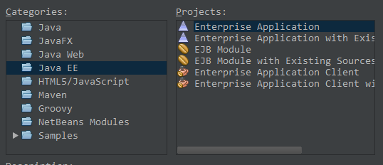
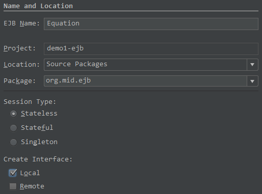
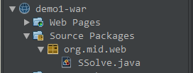
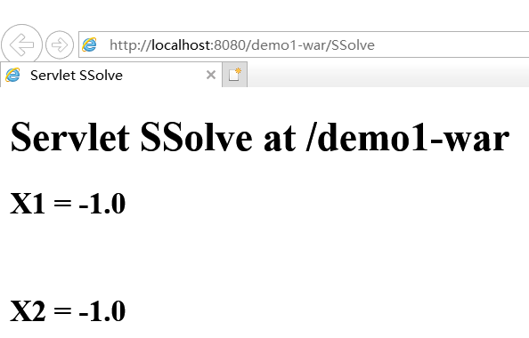
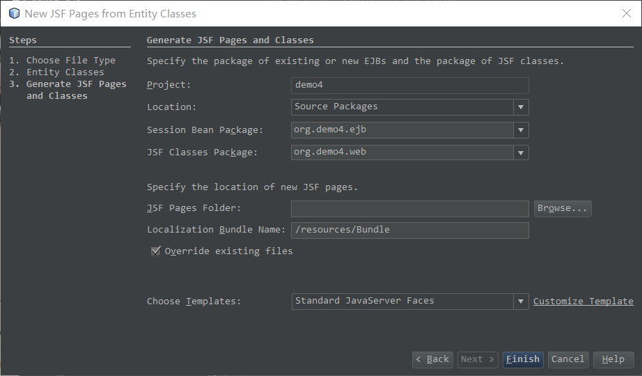

实体组件CRUD的Model 2 + Managed Bean(受管组件) + Session Facade + Entity Bean 开发

Model1 + Session Bean，Model 1 + Session Facade + Entity Bean

## 作业

##### 36、什么是WEB应用前端的Model 1 和Model 2?什么是MVC(Model, View, Control)?常用的Model 2体系结构(architecture)有几种？什么是WEB控件？什么是WEB UI的 Data Binding?什么是Event-Driven Programming?

Model 1 是以页面为中心的Java Web开发，使用 JSP（页面显示） + Java Bean（保存数据和实现业务逻辑） 

Model 2 是基于MVC架构模式的开发模型，Servlet作为前端控制器，只包含控制逻辑和简单的前端处理，调用后端Java Bean来完成实际的逻辑处理，最后转发到相应的JSP页面处理显示逻辑

JSF(JavaServer Faces)，structs，Spring web MVC，Hibernate

可以添加到动态网页中的控件

数据绑定，把model 前端数据层的对象和前端的显示，数据表格，对应起来

基于事件驱动，事件驱动机制

##### 37、什么是Stateless Session Bean, Stateful Session Bean, Session Facade, Entity Bean,Message-Driven Bean? 什么是Java Persistence API?什么是POJO?什么是Appelet, Servlet, Scriptlet,Facelet?什么是受管组件(managed bean)?MB的作用是什么？MB相当于MVC中的哪一层？

Session Facade 对实体组件进行植入操作的代表业务逻辑的会话组件

消息驱动的组件 属于前端组件，使用JMS把实体的对象的数据装到消息驱动的组件里面

##### 38、EJB 2.0, EJB 3.0, EJB 3.1之间的差别是什么？（第六周）

##### 39、在CRUD开发技术路线：Model 1+Session Bean+Entity Bean;Mode1+Session Facade+Entity Bean;Model1+Session Facade+Message-Driven Bean+Entity Bean;Model2+Managed Bean+Session Facade+Entity Bean中，哪一种效率最高？（第六周）

##### 40、在一个Java Server Face中，表单Form的action 属性值与传统的html form的action属性有什么差别？（第六周）


**EJB3.1 抛弃了先定义接口再实现接口的技术路线 **

##  demo1

不带数据库的Model 1 + 会话组件

尽量避免使用带参数的构造函数

### 解一元二次方程

#### 新建工程

+ `new project` -> `Java EE` -> `Enterprise Application`

  

+ 输入项目名称、位置

+ 选择`GlassFish Server 4.1.1` & `Java EE 7`

  

+ 得到 demo1 demo1-**ejb** demo1-**war**

---

#### 新建会话组件

+ demo1-ejb -> new -> session bean 

  

+ 自动插入代码 `insert code` -> `get & set` 

?? Equation.java

```java
package org.mid.ejb;

import javax.ejb.Stateless;
import javax.ejb.LocalBean;

@Stateless
@LocalBean
public class Equation {

    private double a,b,c,x1,x2;
    private Boolean flag;

    // ...get & set
    
    public void solve(){
        double delta = b*b - 4*a*c;
        if(delta < 0)
            this.flag = false;
        else{
            double s = Math.sqrt(delta);
            this.x1 = (-b + s)/2/a;
            this.x2 = (-b - s)/2/a;
            this.flag = true;
        }
    }
}
```

---

#### 新建客户端小程序（Servlet）

+ `demo1-war` -> new -> `Servlet`

  

  

```
package org.mid.web;

import java.io.IOException;
import java.io.PrintWriter;
import javax.ejb.EJB;
import javax.servlet.ServletException;
import javax.servlet.annotation.WebServlet;
import javax.servlet.http.HttpServlet;
import javax.servlet.http.HttpServletRequest;
import javax.servlet.http.HttpServletResponse;
import org.mid.ejb.Equation;

/**
 *
 * @author hp
 */
@WebServlet(name = "SSolve", urlPatterns = {"/SSolve"})
public class SSolve extends HttpServlet {

    @EJB
    private Equation equation;
    // ???????????????????????????????????????????????????
    private double a = 1.0,b = 2.0,c = 1.0;
    
    protected void processRequest(HttpServletRequest request, HttpServletResponse response)
            throws ServletException, IOException {
        response.setContentType("text/html;charset=UTF-8");
        try (PrintWriter out = response.getWriter()) {
            /* TODO output your page here. You may use following sample code. */
            out.println("<!DOCTYPE html>");
            out.println("<html>");
            out.println("<head>");
            out.println("<title>Servlet SSolve</title>");            
            out.println("</head>");
            out.println("<body>");
            out.println("<h1>Servlet SSolve at " + request.getContextPath() + "</h1>");
            this.equation.setA(a);
            this.equation.setB(b);
            this.equation.setC(c);
            this.equation.solve();
            if(this.equation.getFlag()){
                out.println("<h2>X1 = " + this.equation.getX1() +"</h2><br>");
                out.println("<h2>X2 = " + this.equation.getX2() +"</h2><br>"); 
            }else{
                out.println("<h2>No Solution</h2><br>");
            }
            
            out.println("</body>");
            out.println("</html>");
        }
    }

}
```

#### 编译 部署 运行

+ **-ejb**: clean and build 
+ **-war**: `Libraries` -> `Add Jar/Floder` -> `demo1/demo1-ejb/dist/demo1-ejb.jar.`
+ **-ejb**: deploy
+ **-war**: deploy
+ **SSolve.java**: run file



## demo2

Model 1 + Session Facade + Entity Bean

持久化单元？？？？？？？？

## demo3

Model 2 + Managed Bean + Session facade + Entity Bean

硬编码

## demo4



JSF Classes Package：要跟session bean分离开

Localization Bundle Name：方便使用要加/resources/

覆盖

## 课程设计要求

1. 学生信息、四年成绩、奖励
2. 前端界面整合