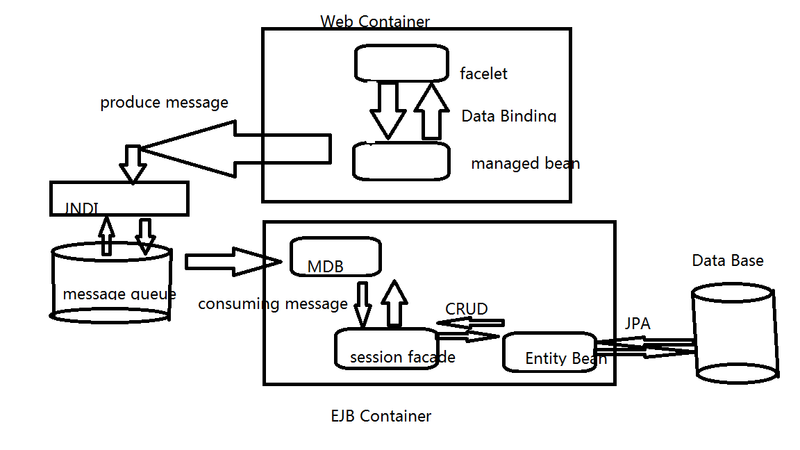
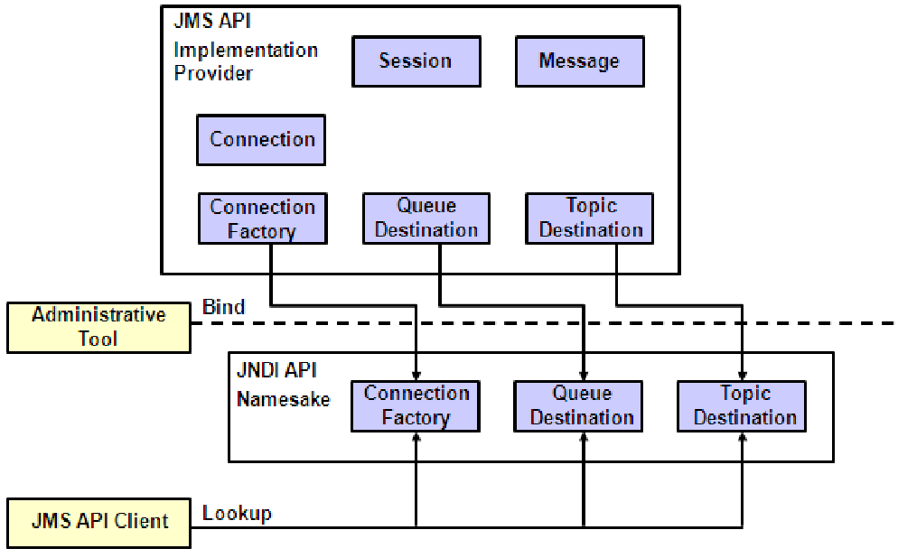
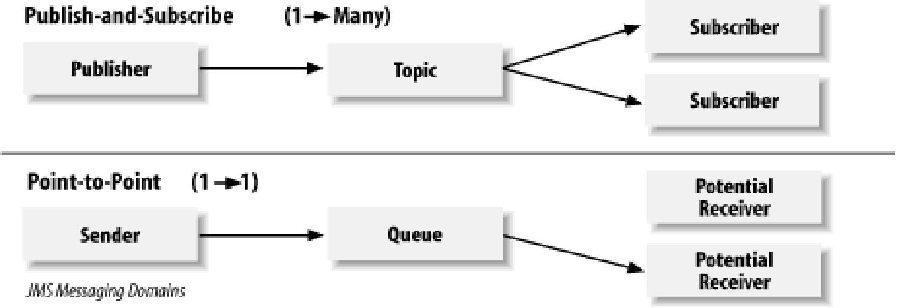
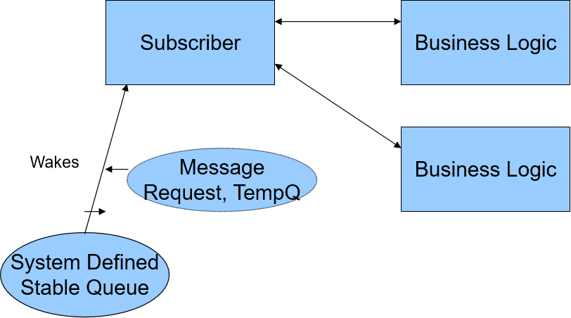
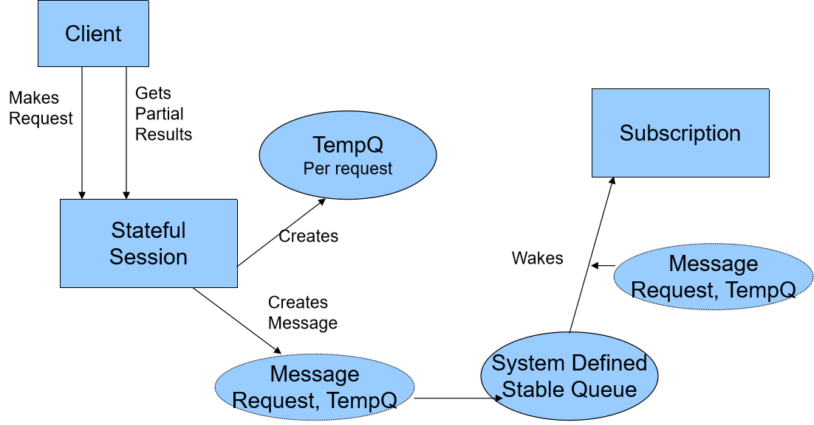

## 基于JMS消息中间件

`MDB`：`Message Driven Bean` 消息驱动组件

`JNDI`：`Java Naming and Directory Interface`  Java命名和目录接口

### Messaging

+ 它启用了松耦合`loosely coupled`的分布式通信。发送方和接收方不需要了解对方信息（目的地和消息格式除外）
+ 作为**对等设施**`peer to peer facilty`的消息传递。
  + 消息客户端可以向其他任何客户端发送邮件或从其他客户端接收消息。
  + 每个消息传递客户端都连接到消息传递代理，该消息传递代理提供了用于创建，发送，接收和读取消息的功能

### JMS API

+ 允许应用程序创建，发送，接收和阅读消息。
+ 消息是
  - 异步：客户端不必为了接收它们而请求它们。
  - 可靠：可以确保一次安全地传递消息。

### JMS & J2EE

+ 应用程序客户端`Application clients`，EJB组件和Web组件可以发送或同步接收JMS消息。
+ 应用程序客户端可以异步接收JMS消息。
+ MDB启用消息的异步使用。
+ 与现有的企业信息系统（EIS）进行交互时，可以代替连接器体系结构使用。

### JMS Architecture

+ JMS提供者：是一个消息传递系统，它实现JMS接口并提供管理和控制功能

+ JMS客户端：是用Java编写的可产生或使用消息的程序或组件。

+ 消息：是在JMS客户端之间传递信息的对象。

+ 受管对象`Administerd objects JMS消息服务器`是管理部门为使用客户端而创建的预配置JMS对象。 

  + 两种受管对象：

    + 目的地`destinations 消息队列，JMS的消息数据库` 

    + 连接工厂`connection factories JNDI 多个会话线程`。

+ 连接和会话 `connections & sessions`

bind：

### Messaging Domains

点对点（PTP `point-to-point`）应用程序是围绕消息队列，发送者和接收者的概念构建的。

+ 每个消息都发送到特定的队列，并且接收客户端从为保留其消息而建立的队列中提取消息。
+ 每个消息只有一个使用者。
+ 发送者和接收者没有时间依赖性。
+ 接收者确认消息已成功处理。
+ 当您发送的**每条消息必须由一个使用者成功处理**时，请使用PTP。

### Publish/Subscribe domain

+ 客户端将消息发送到某个主题`topic`。
+ 每个消息可能有多个使用者。
+ 发布者和订阅者具有时间依赖性。
+ 发布者和订阅者通常是匿名的，系统负责分发消息。

### Message 组成

+ Headers 头部
  + Automatically Assigned 自动指定（常用）
  + Developer Assigned 开发者指定
+ Properties 属性
  + Application Specific 基于应用
  + JMS Specific 基于JMS
  + Provider (Vendor) specific
+ Payload
  + Data 数据
  + Event 事件

### Message Selectors

+ Used by the JMS clients to filter messages
+ Boolean logic applied to
  + Header values
  + Property values
  + Based on a subset of the SQL-92 syntax of the WHERE clause

### Message Types

+ Message
  + Contains only headers and properties
  + Useful for Event notification
+ TextMessage
  + Java String is the payload
  + Useful for XML data
+ ObjectMessage
  + Serializable Java Obect （可序列化的java对象） as payload

+ BytesMessage
  + Useful for exchanging data in the application’s native format
  + Useful when just providing transport
+ StreamMessage
  + Payload is made up of Java primitive types (int, double, long, char, etc)
+ MapMessage
  + Payload is name-value pair
  + The name must be String
  + The value can be a String or primitive

### Message Acknowledgements 消息回执

+ `AUTO_ACKNOWLEDGE`    Ack is provided by the Provider
+ `DUPS_OK_ACKNOWLEDGE`    Ack is provided by the Provider
+ `CLIENT_ACKNOWLEDGE`    Client explicitly acks each message

### JNDI

+ 提供Java API来访问专有`proprietary`和异构`heterogeneous`命名服务。
+ 系统管理员负责创建，配置和绑定提供者的受管对象`Administered Objects of Provider`
  + `Destinations`：主题（一对多）和队列（一对一） `topic & queues`
  + `ConnectionFactory`：客户端用于创建与消息服务器的连接。

### Message Models 消息模型

+ `Publish / Subscribe` 发布 / 订阅
  + 生产者可以发送给多个消费者
  + 通过主题`topic`的虚拟渠道完成
  + Push model
  + 同步 or 异步
+ `Point to Point` 点对点
  + 生产者向一个消费者发送
  + 通过队列`Queue`的虚拟渠道完成
  + Pull Model
  + 异步 or 同步

## Query Federation

### Producer / Consumer

**The Messaging Client is a Producer **, Producers create messages by writing them to a Queue or Topic.

### Java & JMS

在Java中，所有类型的参与者都可以使用JMS将消息发送到各个目的地。 

这些消息被其他Java应用程序或MDB占用。 

JMS通过使用消息传递服务（有时称为消息代理或路由器）来促进从企业bean发送消息。

### JMS is Asynchronous

RMI（远程方法调用）  RMI是组装事务性组件的绝佳选择，但对于某些用途来说过于严格。必须要紧耦合

### JMS & EJB

Enterprise Message Broker 企业级消息代理

### Loosly Coupled

该技术具有解耦`decoupled`的异步特性，这意味着发送者的事务和安全上下文` transactions and security contexts`不会传播到消息的接收者

