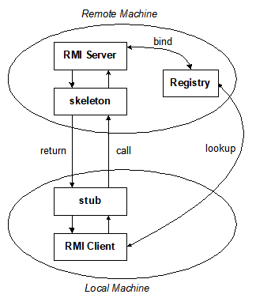

## RMI / IIOP, Java IDL, CORBA

### RMI (Remote Method Invocation) 

**参考：**[远程方法调用原理与实例](https://www.cnblogs.com/wxisme/p/5296441.html)

允许像调用本地方法一样调用远程方法

#### RMI的三个抽象层

高层覆盖低层, 分别负责Socket通信、参数和结果的序列化和反序列化

`Transport Layer`  ----  依赖于 TCP/IP 协议实现客户机与服务器的互联

`Remote Reference Layer`  ----  寻找各自的通信伙伴，命名目录服务器`Registry`

`Stubs & Skeletons`  ----  形成RMI构架协议

#### RMI过程



绑定：将对象及对象参照`Object Reference`绑定在命名目录服务器中

客户端调用远程方法时，

+ stub将相关数据（方法名，参数）打包，向下经远程引用层、传输层转发给远程对象所在的服务器。

+ 通过 RMI 系统的 RMI 注册表实现的简单服务器名字服务, 可定位远程对象所在的服务器。
+ 该包到达服务器后, 向上经远程引用层, 被远程对象的 Skeleton 接收, 此 Skeleton 解析客户包中的方法名及编组的参数后,

-  在服务器端执行客户要调用的远程对象方法, 然后将该方法的返回值( 或产生的异常) 打包后通过相反路线返回给客户端, 

- 客户端的 Stub 将返回结果解析后传递给客户程序。

事实上, 不仅客户端程序可以通过存根调用服务器端的远程对象的方法, 而服务器端的程序亦可通过由客户端传递的远程接口回调客户端的远程对象方法。

在分布式系统中, 所有的计算机可以是服务器, 同时又可以是客户机。

#### Steps for Developing an RMI System

```
Define the remote interface
Develop the remote object by implementing the remote interface.
Develop the client program.
Compile the Java source files.
Generate the client stubs and server skeletons.
Start the RMI registry.
Start the remote server objects.
Run the client 
```

### IIOP

Internet Inter-ORB Protocol    ----    互联网内部对象请求代理协议

### Java IDL

IDL用于描述**客户端对象调用和对象实现提供**的接口。该规范通过将接口与实现分开来实现互操作性。
它不是编程语言，没有构造。它通过OMG标准映射到许多编程语言，例如C，C ++，Java和COBOL。

接口是服务器对象提供给 调用它的客户端 的 协定的语法部分。
客户端仅通过其设置的接口访问对象，仅调用 对象通过其IDL接口公开的 那些操作，并且仅使用调用中包括的那些参数（输入和输出）。

IDL接口定义独立于编程语言。
使用接口编译器将其映射到编程语言。

###### Example

```idl
module Calc{  // module 模块
   interface Calculator {
        // in 代表参数传递的方向 in / out / inout 
   		float  calculate(in float val1, in float val2, in char operator);
   }
}
```

##### Mapping IDL to Java,C++

|    IDL    |      Java       |        C++        |
| :-------: | :-------------: | :---------------: |
|  module   |     package     |     namespace     |
| interface |    interface    |  abstract class   |
| operation |     method      |  member function  |
| attribute | pair of methods | pair of functions |
| exception |    exception    |     exception     |

##### Declaring Data Members

`attribute long assignable;`，必须包含名称&类型，可以限制可读不可写`readonly`，IDL编译器会自动生成读写方法。

`const float s = 2.3;` => `public static final`，接口内部未声明的常量将映射到具有相同名称（包含字段值`value`）的公共接口`public interface`。

`typedef string name;`，可以自定义类型

`float  calculate(in float val1, in float val2, in char operator);`，方法名，返回类型，参数，可能抛出异常时必须声明。默认是同步的`synchronous`，`oneway`声明为异步`Asynchronous`，此时没有返回值，只有输入参数，不能引发异常，客户端不被blocked

`System Exceptions & User Exceptions` 用户异常在对象的IDL定义内声明，由IDL编译器自动生成，实现依赖于语言映射。

###### example

```idl
module Calc{
  interface Calculator{
	//User-defined exception
     exception MyException{};
	//synchronous method
	float calculate(in float val1, in float val2, in char operator) raises (MyException);
	//asynchronous method
	oneway void set_value(in long val);
  };
}; 
```

##### Declaring Parameters

数据类型：Basic (`char, long, short, float, bool`, etc.), Constructed (`struct, union, array, sequence`), `Typed objects`, or any.

`in`：client => server ，`out & inout`

CORBA 2.0仅支持非对象数据类型的按值传递。 对象通过引用传递。
CORBA 3.0通过使用`valuetype`关键字支持对象的按值传递。


### CORBA