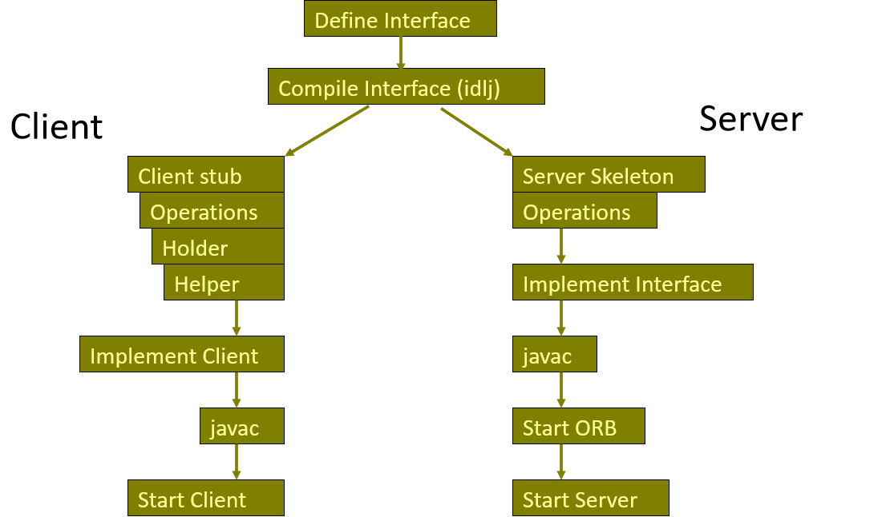
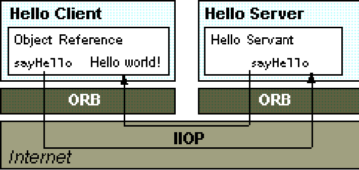

## RMI / IIOP, Java IDL, CORBA

### RMI (Remote Method Invocation) 

**参考：**[远程方法调用原理与实例](https://www.cnblogs.com/wxisme/p/5296441.html)

允许像调用本地方法一样调用远程方法

#### RMI的三个抽象层

高层覆盖低层, 分别负责Socket通信、参数和结果的序列化和反序列化

`Transport Layer`  ----  依赖于 TCP/IP 协议实现客户机与服务器的互联

`Remote Reference Layer`  ----  寻找各自的通信伙伴，命名目录服务器`Registry`

`Stubs & Skeletons`  ----  形成RMI构架协议

#### RMI过程


绑定：将对象及对象参照`Object Reference`绑定在命名目录服务器中

客户端调用远程方法时，

+ stub将相关数据（方法名，参数）打包，向下经远程引用层、传输层转发给远程对象所在的服务器。

+ 通过 RMI 系统的 RMI 注册表实现的简单服务器名字服务, 可定位远程对象所在的服务器。
+ 该包到达服务器后, 向上经远程引用层, 被远程对象的 Skeleton 接收, 此 Skeleton 解析客户包中的方法名及编组的参数后,

-  在服务器端执行客户要调用的远程对象方法, 然后将该方法的返回值( 或产生的异常) 打包后通过相反路线返回给客户端, 

- 客户端的 Stub 将返回结果解析后传递给客户程序。

事实上, 不仅客户端程序可以通过存根调用服务器端的远程对象的方法, 而服务器端的程序亦可通过由客户端传递的远程接口回调客户端的远程对象方法。

在分布式系统中, 所有的计算机可以是服务器, 同时又可以是客户机。

#### Steps for Developing an RMI System

```
Define the remote interface
Develop the remote object by implementing the remote interface.
Develop the client program.
Compile the Java source files.
Generate the client stubs and server skeletons.
Start the RMI registry.
Start the remote server objects.
Run the client 
```

### IIOP

Internet Inter-ORB Protocol    ----    互联网内部对象请求代理协议

---

### Java IDL

IDL用于描述**客户端对象调用和对象实现提供**的接口。该规范通过将接口与实现分开来实现互操作性。
它不是编程语言，没有构造。它通过OMG标准映射到许多编程语言，例如C，C ++，Java和COBOL。

接口是服务器对象提供给 调用它的客户端 的 协定的语法部分。
客户端仅通过其设置的接口访问对象，仅调用 对象通过其IDL接口公开的 那些操作，并且仅使用调用中包括的那些参数（输入和输出）。

IDL接口定义独立于编程语言。
使用接口编译器将其映射到编程语言。

###### Example

```idl
module Calc{  // module 模块
   interface Calculator {
        // in 代表参数传递的方向 in / out / inout 
   		float  calculate(in float val1, in float val2, in char operator);
   }
}
```

##### Mapping IDL to Java,C++

|    IDL    |      Java       |        C++        |
| :-------: | :-------------: | :---------------: |
|  module   |     package     |     namespace     |
| interface |    interface    |  abstract class   |
| operation |     method      |  member function  |
| attribute | pair of methods | pair of functions |
| exception |    exception    |     exception     |

##### Declaring Data Members

`attribute long assignable;`，必须包含名称&类型，可以限制可读不可写`readonly`，IDL编译器会自动生成读写方法。

`const float s = 2.3;` => `public static final`，接口内部未声明的常量将映射到具有相同名称（包含字段值`value`）的公共接口`public interface`。

`typedef string name;`，可以自定义类型

`float  calculate(in float val1, in float val2, in char operator);`，方法名，返回类型，参数，可能抛出异常时必须声明。默认是同步的`synchronous`，`oneway`声明为异步`Asynchronous`，此时没有返回值，只有输入参数，不能引发异常，客户端不被blocked

`System Exceptions & User Exceptions` 用户异常在对象的IDL定义内声明，由IDL编译器自动生成，实现依赖于语言映射。

###### example

```idl
module Calc{
  interface Calculator{
	//User-defined exception
     exception MyException{};
	//synchronous method
	float calculate(in float val1, in float val2, in char operator) raises (MyException);
	//asynchronous method
	oneway void set_value(in long val);
  };
}; 
```

##### Declaring Parameters

数据类型：Basic (`char, long, short, float, bool`, etc.), Constructed (`struct, union, array, sequence`), `Typed objects`, or any.

`in`：client => server ，`out & inout`

CORBA 2.0仅支持非对象数据类型的按值传递。 对象通过引用传递。
CORBA 3.0通过使用`valuetype`关键字支持对象的按值传递。

##### Interface Compliers

IDL编译器在软件中实现语言映射。
他们编译接口定义（使用IDL定义），以生成可编译并与对象实现及其客户端链接的输出。
每个ORB都带有一个或多个IDL编译器，每种支持的语言都一个。

IDL允许对象实现者为对象选择适当的编程语言。 客户端和服务器可以并行开发。
客户端仅取决于接口，而不取决于服务器代码的实现。

通过使用IDL和接口编译器，可以独立于编程语言定义以下内容：

- 模块化的对象接口 `Modularized object interfaces `
- 对象支持的操作和属性 `Operations and attributes that an object supports `
- 操作引发的异常 `Exceptions raised by an operation `
- 操作返回值的数据类型，其参数和对象的属性 `Data types of an operation return value, its parameters, and an object's attributes `

##### The idlj compiler

`idlj -fall <idl_file_name>`

`-fall` 同时创建客户端和服务器文件

`-fclient` ==默认== 只创建客户端文件

`-fserver` 只创建服务器文件

创建以下的类：

**Both**

`Calc.Calculator`  表示为Java接口的IDL接口

`Calc.CalculatorOperations`   定义公开的远程方法的接口。

**Client**

`Calc.CalculatorHelper`   实现接口的类型操作

`Calc.CalculatorHolder `   用于out和inout参数

`Calc._CalculatorStub`   客户端存根。 实现一个表示远程CORBA对象的本地对象。 该对象将所有请求转发到远程对象。 客户端不直接使用此类。

**Server**

`Calc._CalculatorImplBase`   实现Calculator接口的抽象类。 它是服务器的骨架。

#### 实现流程？

- Implement the client
- Compile the client
- Implement the server
- Compile the server
- Start ORB
- Start server
- Start client



#### References

Client/Server Programming with Java and CORBA – Robert Orfali and Dan Harkey
http://developer.java.sun.com
http://www.omg.org
http://www.infosys.tuwien.ac.at/Research/Corba
http://www.objs.com

---

### CORBA

Common Object Resource Broker Architecture 公用对象体系代理结构

Interface Definition Language (IDL) 接口定义语言

Object Management Group ([OMG](http://www.omg.org)) Specification

Java IDL (jdk1.2) 使用了CORBA

分布式对象技术

Object Requst Broker（ORB）支持CORBA对象之间的低级通信

#### 架构



CORBA和RMI共有的客户端和服务器关系

服务器提供远程接口，客户端调用远程接口

对象级交互而不是应用程序级交互（sockets）

对象可以同时扮演两个角色

##### 客户端

客户端有远程对象的引用（stub）

ORB 屏蔽底层网络通讯的异构性

stub连接到ORB，调用stub会调用ORB的低级通信例程，ORB将调用转发到服务器

##### 服务器

服务器端的ORB使用 Skeleton Code 将远程调用转换为对本地对象的调用，Skeleton 转换结果或错误并返回到ORB以交付给客户，与IIOP（Internet间ORB协议）进行ORB-ORB通信

#### ORB

+ 不同的供应商，相同的规范不同的厂家
+ IIOP是在TCP/IP上构建的，OMG使用IIOP
+ ORB服务
  + 定位  Look up（JDK1.2）
  + 对象持久化 Object Persistence
  + Transactions
  + Messaging

#### Java IDL 开发

+ 使用IDL定义到远程对象的接口

+ idlj编译器生成stub和skeleton source，并提供与ORB接口的代码

+ 可以使用任何CORBA兼容语言（C，C ++，Smalltalk，COBOL，Ada）实现IDL接口

+ 编译远程接口（idlj）
+ 运行服务器。 它应该启动ORB并等待客户端的调用，并实现远程方法。
+ 运行客户端。 启动ORB，查找服务器，获取远程引用，然后调用远程方法
+ 启动应用程序。

---

hello.idl

```idl
module HelloApp{
	interface Hello{
		string sayHello();
		oneway void shutdown();
  	};
}
```

The HelloServer class has the server's main() method, which:

+ Creates and initializes an ORB instance 创建和初始化一个ORB实例
+ Gets a reference to the root POA  and activates the POA Manager 获取POA的根的参照，激活POA的管理器对象
+ Creates a servant instance (the implementation of one CORBA Hello object) and tells the ORB about it  创建一个伺服对象实例
+ Creates a tie with the servant being the delegate  把伺服对象绑定到命名目录服务器
+ Gets a CORBA object reference for a naming context in which to register the tie. This step also implicitly activates the object. 
+ Gets the root naming context
+ Registers the new object in the naming context under the name "Hello"
+ Waits for invocations of the new object from the client from the client

POA`portable object Adapter`：是ORB的用于管理远程对象的子模块

HelloServer.java

```java
// Copyright and License 
import HelloApp.*;
import org.omg.CosNaming.*;
import org.omg.CosNaming.NamingContextPackage.*;
import org.omg.CORBA.*;
import org.omg.PortableServer.*;
import org.omg.PortableServer.POA;

import java.util.Properties;

class HelloImpl extends HelloPOA{  // 伺服对象要继承POA
  private ORB orb;

  public void setORB(ORB orb_val){
    orb = orb_val;
  }
  
  public String sayHello(){
    return "\nHello world !!\n";
  }
  
  public void shutdown(){
    orb.shutdown(false);
  }
}
public class HelloServer{

  public static void main(String args[]){
    try{
      // create and initialize the ORB
      ORB orb = ORB.init(args, null);

      // Get reference to rootpoa & activate the POAManager
      POA rootpoa = POAHelper.narrow(orb.resolve_initial_references("RootPOA"));
      rootpoa.the_POAManager().activate();

      // create servant and register it with the ORB
      HelloImpl helloImpl = new HelloImpl();
      helloImpl.setORB(orb); 

      // create a tie, with servant being the delegate.
      HelloPOATie tie = new HelloPOATie(helloImpl, rootpoa);

      // obtain the objectRef for the tie
      // this step also implicitly activates the 
      // the object
      Hello href = tie._this(orb);
	    
      // get the root naming context
      org.omg.CORBA.Object objRef = orb.resolve_initial_references("NameService");
      
      // Use NamingContextExt which is part of the Interoperable
      // Naming Service specification.
      NamingContextExt ncRef = NamingContextExtHelper.narrow(objRef);

	  // bind the Object Reference in Naming
      String name = "Hello";
      NameComponent path[] = ncRef.to_name( name );
      ncRef.rebind(path, href);

      System.out.println("HelloServer ready and waiting ...");

      // wait for invocations from clients
      orb.run();
      } 
      
    catch (Exception e){
      System.err.println("ERROR: " + e);
      e.printStackTrace(System.out);
    }
    
    System.out.println("HelloServer Exiting ...");
  }
```

HelloClient.java

```java
import HelloApp.*;
import org.omg.CosNaming.*;
import org.omg.CosNaming.NamingContextPackage.*;
import org.omg.CORBA.*;

public class HelloClient{

  public static void main(String args[]){
  
    try{
      // create and initialize the ORB
      ORB orb = ORB.init(args, null);

      // get the root naming context
      org.omg.CORBA.Object objRef = 
	  orb.resolve_initial_references("NameService");
	  
      // Use NamingContextExt instead of NamingContext. This is 
      // part of the Interoperable naming Service.  
      NamingContextExt ncRef = NamingContextExtHelper.narrow(objRef);
 
      // resolve the Object Reference in Naming
      String name = "Hello";
      Hello helloImpl = HelloHelper.narrow(ncRef.resolve_str(name));

	  System.out.println("Obtained a handle on server object: " + helloImpl);
      System.out.println(helloImpl.sayHello());
      helloImpl.shutdown();
      }
      catch (Exception e) {
      System.out.println("ERROR : " + e) ;
      e.printStackTrace(System.out);
    }
  }
}
```


---

