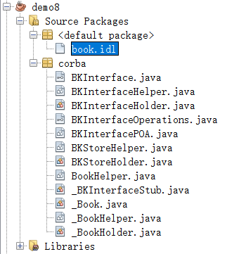
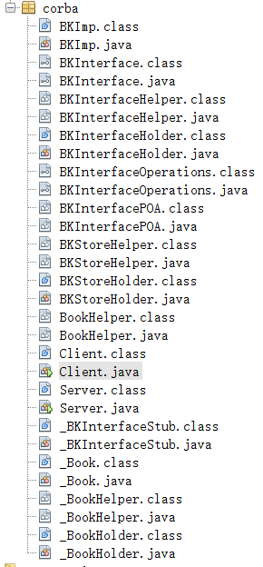
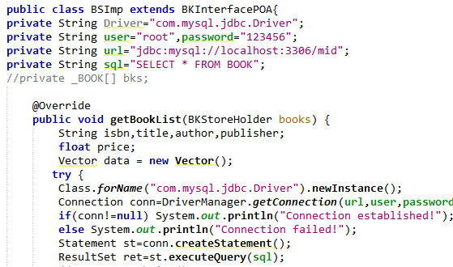

新建java Application

在src下添加文件

book.idl

```idl
module corba
{
    typedef struct _Book
    {
        string isbn;
        string title;
        string author;
        string publisher;
        string price;
    }Book;
    typedef sequence<Book> BKStore;
    interface BKInterface
    {
        void getBookList(out BKStore books);
    };
};
```

编译IDL文件：`idlj -fall book.idl`



在corba包中新建java类BKImp

```java
public class BKImp extends BKInterfacePOA{
    private String driver = "com.mysql.jdbc.Driver";
    private String user = "root";
    private String pwd = "123456";
    private String url = "jdbc:mysql://localhost:3306/mid";
    private String sql = "select * fron book";
    
    private _Book[] bks;
    private Vector data = new Vector();

    @Override
    public void getBookList(BKStoreHolder books) {
        //throw new UnsupportedOperationException("Not supported yet."); //To change body of generated methods, choose Tools | Templates.
        String isbn,title,author,publisher;
        float price;
        try{
            Class.forName(driver).newInstance();
            Connection con = DriverManager.getConnection(url,user,pwd);
            if(con != null)
                System.out.println("Connection established!");
            else System.out.println("Connection failed!");
            Statement st = con.createStatement();
            ResultSet ret = st.executeQuery(sql);
            while(ret.next()){
                isbn = ret.getString(1);
                title = ret.getString(2);
                author = ret.getString(3);
                publisher = ret.getString(4);
                price = ret.getFloat(5);
                
                _Book bk = new _Book(isbn,title,author,publisher,price);
                this.data.add(bk);
                
                System.out.println(ret.getString(1)+"\t"+ret.getString(2)+"\t"+ret.getString(3)+"\t"+ret.getString(4) + "\t" + ret.getFloat(5));
            }
            bks = new _Book[data.size()];
            Enumeration ptr = data.elements();
            int j = 0;
            while(ptr.hasMoreElements())
            {
                bks[j] = (_Book)ptr.nextElement();
                j++;
            }
            books.value = bks;
        }catch(Exception ex){
            ex.printStackTrace();
        }
    }
    
}

```

编写服务器、客户端

在corba包中新建Server、Client类


编译

`javac *.java`



问题



Class.forName(“Driver”).newInstance();

https://blog.csdn.net/u012851188/article/details/50929644