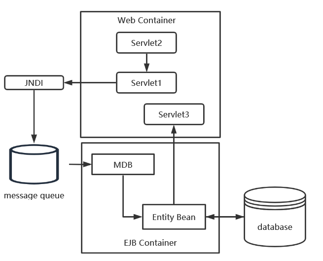

#### 大作业

**题目：基于JMS(Java Message Service)、MDB(Message-Driven Bean)以及Servlets的图书录入和清单打印系统的设计和实现。**

直接在MDB持久化实体类

1、用图形和文字叙述设计原理。（限500字）（30分）

2、说明开发工具的搭建以及系统参数的设置并附==测试截图==。（20分）

3、详细说明核心算法及关键代码。（20分）

4、系统的测试截图。（10分）

5、附录完整代码。（10分）

6、简单讨论软件的升级和替代技术。（10分）

要求：不得改变封面页和题目页，答题从第三页开始，文字全部用小五字体，原则上不超过20页。于第12周周五前把大作业电子版打包发送到邮箱**mid2019202_theory@163.com**

打包的格式是班级加姓名（例如软件1704夏好好）。不得抄袭雷同，否则不得分。

#### 实验

实验一：基于JMS-Session Facade图书录入及打印清单分布式应用设计及开发

实验二：基于Java IDL和MySql图书清单录入和清单打印系统

#### 作业

第二周：利用Eclipse或XMLSpy设计一个个人联系方式（QQ，微信，手机号，住址。。。。。。）XML大纲和一个XML实例文档

第三周：利用Eclipse设计一个求解一元二次方程的WSDL文档（后来改掉了）

**第四周：利用GlassFish 4.1+NetBean8.1设计一个求解一元二次方程的无状态会话组件及B/S分布式应用。**

第五周：利用GlassFish 4.1+NetBean8.1设计一个学籍管理系统BS分布式应用。

**第六周：利用实体组件CRUD的Model2+Managed Bean+Session Facade+Entity Bean开发方法设计一个学籍管理系统BS分布式应用。**

第七周：利用RMI/IIOP, Java IDL开发分布式数据库应用。

第八周：开发一个JSF+Managed Bean+MDB BS-分布式应用。

#### 问答题

