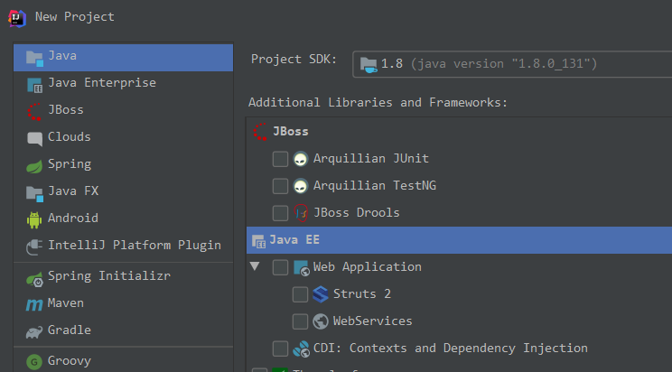
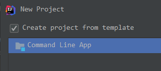
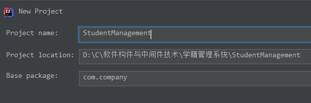
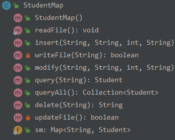

#### 新建工程







#### java.util.map



```java
public String insert(String ID, String name, int grade, String password) {   // 增加一个学生
        Student st = new Student(ID, name, grade, password);
        if (sm.get(ID) != null) {
            return "Repeat ID!";
        } else {
            sm.put(ID, st);

            if (writeFile(ID))
                return "Insert successfully!";

        }
        return "Fail to update file!";
    }
```

```java
public String modify(String ID, String name, int grade, String password) {   // 修改学生信息
        Student st = new Student(ID, name, grade, password);
        sm.put(ID, st);
        if (updateFile())
            return "Modify successfully!";
        else
            return "Fail to update file!";

    }
```

```java
public Student query(String ID) {   // 通过ID查询一名学生
        return sm.get(ID);
    }

    public Collection<Student> queryAll() {  // 查询所有学生
        return sm.values();
    }
```

```java
public String delete(String ID) {  // 通过ID删除一名学生
        if (sm.get(ID) == null) {
            return "No student found!";
        } else {
            sm.remove(ID);
            if (updateFile())
                return "Delete successfully!";
        }
        return "Fail to update file!";
    }
```

#### 读写文件

删掉重新写

```java
    private boolean updateFile() {
        File file = new File("src/student.txt");
        if (file.exists()) {
            if (!file.delete()) {
                System.out.println("Fail to delete file!");
                return false;
            }
        }
        try {
            if (!file.createNewFile()) {
                System.out.println("Fail to create file!");
                return false;
            }

            FileWriter fileWriter = new FileWriter(file);
            for (Student st : sm.values()) {
                fileWriter.write(st.getID() + "," + st.getName() + "," + st.getGrade() + "," + st.getPassword() + "\n");
                fileWriter.flush();
            }

            fileWriter.close();
        } catch (IOException e) {
            e.printStackTrace();
        }
        return true;
    }
```

读

```java
public static void readFile() throws IOException {
    String path = "src/student.txt";
    FileInputStream in = new FileInputStream(path);
    BufferedReader bufferedReader = new BufferedReader((new InputStreamReader(in)));
    String line;
    while ((line = bufferedReader.readLine()) != null) {
        //System.out.println(line);
        String[] stu = line.split(",");
        sm.put(stu[0], new Student(stu[0], stu[1],
                stu[2].toCharArray()[0] - '0', stu[3]));
    }
    in.close();
}
```

写

```java
private boolean writeFile(String ID) {

    File file = new File("src/student.txt");
    if (!file.exists()) {
        System.out.println("File does not exist!");
        return false;
    }
    FileOutputStream fileOutputStream = null;
    try {
        fileOutputStream = new FileOutputStream(file, true);

        Student st = sm.get(ID);
        fileOutputStream.write((st.getID() + "," + st.getName() + "," + st.getGrade() + "," + st.getPassword() + "\n").getBytes());
        fileOutputStream.close();
    } catch (IOException e) {
        e.printStackTrace();
    }
    return true;
}
```

#### 其他

`String.split(regex)`: 特殊字符要`//`转义

Main函数中的Scanner，调用其他函数后，在其他函数中要新建Scanner，但其他函数结束时不能close。

Exception加在哪里比较合适..

当前目录是src的上层，而且好像不加`/`

