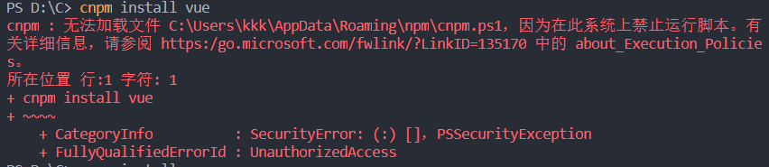

包管理工具

```
npm unistall express
npm ls
npm update express
npm search express
npm install -g cnpm --registry=https://registry.npm.taobao.org
npm cache clean
```

创建模块

```
PS D:\C\JS\node.js\modules> npm init

This utility will walk you through creating a package.json file.
It only covers the most common items, and tries to guess sensible defaults.

See `npm help json` for definitive documentation on these fields
and exactly what they do.

Use `npm install <pkg>` afterwards to install a package and
save it as a dependency in the package.json file.

Press ^C at any time to quit.
package name: (modules) 0228                 # 模块名
version: (1.0.0)
description: 20200228                        # 描述
entry point: (index.js)
test command: make test
git repository:                              # Github仓库
keywords:
author:
license: (ISC)
About to write to D:\C\JS\node.js\modules\package.json:  # 生成地址

{
  "name": "0228",
  "version": "1.0.0",
  "description": "20200228",
  "main": "index.js",
  "scripts": {
    "test": "make test"
  },
  "author": "",
  "license": "ISC"
}


Is this OK? (yes)
```

```
npm adduser
npm publish
npm unpublish <package>@<version>

npm help <command>
npm install . -g   # 先在本地安装当前命令行程序
npm update <package> 
npm update <package> -g

```

版本号 x.x.x

大变动向下不兼容 . 新增功能向下兼容 . 修复bug

%JAVA_HOME%\bin;%JAVA_HOME%\jre\bin;%USERPROFILE%\AppData\Local\Microsoft\WindowsApps;C:\Python27;C:\Python27\Scripts;C:\wamp64\bin\mysql\mysql5.7.24\bin;C:\Python37;C:\Python37\Scripts;D:\Mongo\bin;D:\tools\Nmap;%MAVEN_HOME%\bin;D:\IDE\Microsoft VS Code\bin;C:\Users\hp\AppData\Roaming\npm;%PyCharm%;D:\SoftwareTesting\TestCenter\DBSVR\bin;%CATALINA_HOME%\lib;%CATALINA_HOME%\lib\servlet-api.jar;%CATALINA_HOME%\lib\jsp-api.jar;

+++



在PowerShell中输入set-ExecutionPolicy RemoteSigned，根据提示输入A/Y

+++

#### 修改node.js默认的npm安装目录

```
PS D:\C> npm config set prefix "D:\nodejs\npm"
PS D:\C> npm config set cache "D:\nodejs\npm\cache"
```

