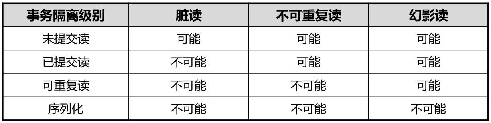

GaussDB T：预置如下角色：DBA/RESOURCE/CONNECT/STATISTICS 

GaussDB A：仅预置DBA。

zsql介绍： GaussDB T为用户提供的一种交互和查询的客户端工具。
gsql介绍： GaussDB A提供在命令行运行的交互式数据库连接工具。
Data Studio介绍：Data Studio是一款GUI工具，可以通过它来连接数据库，调试执行SQL语句和存储过程。

DCL （Data Control Language）数据控制语言

用来设置或更改数据库事务、权限操作（用户或角色授权，权限回收）、锁表（支持共 享锁和排他锁两种锁表模式）、停机等。

DQL （Data Query Language）数据查询语言

用来查询数据库内的数据，如单表查询、多表查询。

DDL（Data Definition Language）数据定义语言

用于定义或修改数据库中的对象，如：表、索引、视图、序列、用户、角色、表空间等。

DML （Data Manipulation Language）数据操纵语言

用于对数据库表中的数据进行操作，如插入，更新和删除。 显式提交

-f -c -s 互斥操作

视图不占用存储空间

-d指定数据库目录 -q取消SSL认证登录查看，可与-w同时使用 -s无提示模式 -w等待超时时间 默认10s

8<=密码长度<=64

审计级别：1-DDL 2-DCL 4-DML 8-PL