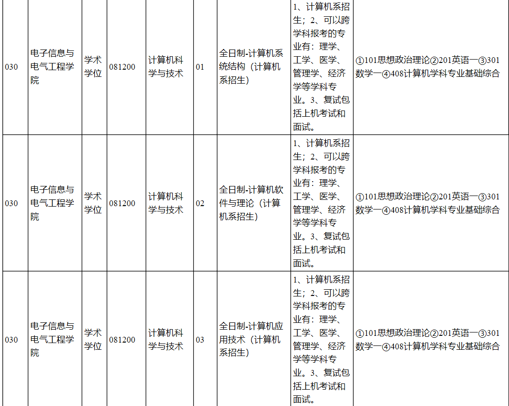
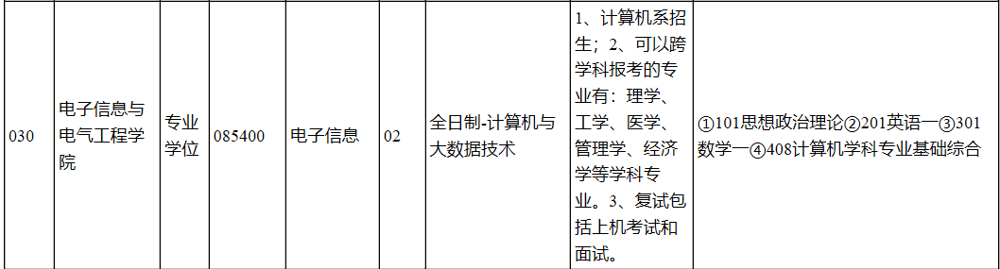
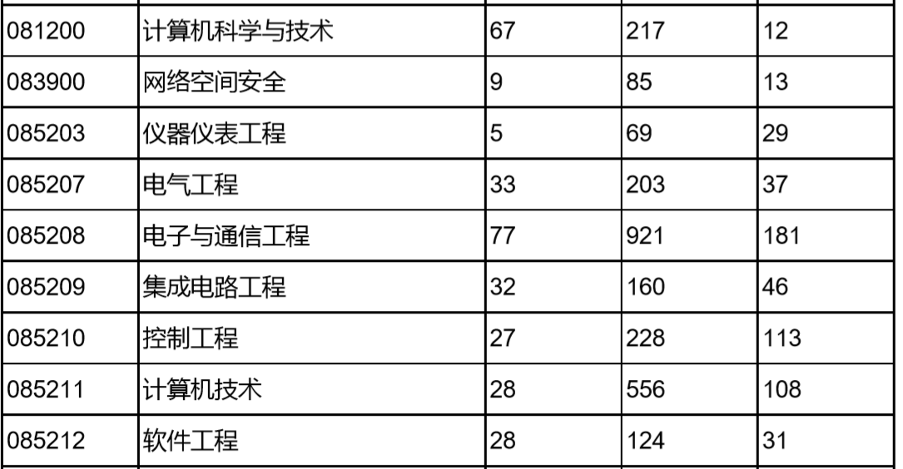
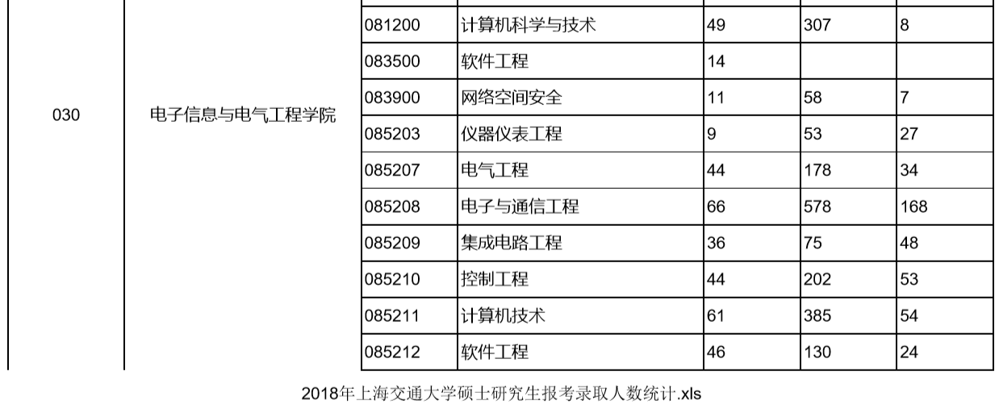

## 北京

#### 北京理工

#### 北京邮电

考试科目：①101思想政治理论②201英语一③301数学一④803计算机学科基础综合

## 武汉

#### 华中科技

考试科目：①101思想政治理论 ②201英语一 ③301数学一④834计算机专业基础综合(数据结构、计算机网络)

## 上海

#### 上海交通大学

https://yzb.sjtu.edu.cn/info/1022/2464.htm

#### 同济大学

http://www.noobdream.com/schoolinfo/113/

**初试科目：**

**电子与信息工程学院**

思想政治理论、 英语一、数学一、408美滋滋

**软件学院**

思想政治理论、 英语一、数学一、408美滋滋

19/18专硕未招收统考生

**复试科目：**

**电子与信息工程学院**

笔试（专业课+专业外语）+面试（专业综合+外语口语听力），无机试

笔试试卷是全英文的，绝大部分都是数据库的题，(只有一两道涉及c语言指针、数组的选择题）

**软件学院**

笔试（专业课+专业外语）+面试（专业综合+外语口语听力），无机试

笔试试卷是全英文的，包含高数、数据结构、数据库、C语言等科目

**录取情况**

**19年复试情况**

**电子与信息工程学院**

**计算机专硕**

49人复试，7人未录取【341-409】

**软件学院**

**软件学硕**

进入复试人数24人 平均分348【321-390】

录取15人【326-390】

**18年复试情况**

**电子与信息工程学院**

**计算机学硕**

分数线325，50，55，90

229人报考，27人进入复试，录取13人,均分362

**计算机专硕**

分数线325，50，55，90

175人报考，38人进入复试，录取36人,均分345

**软件学院**

**软件学硕**

**连续两年招收校内调剂**

分数线305，55，55，80，70

62人报考，一志愿进复试11人，录取10人

调剂分数线305，55，55，80，70

调剂复试20人，录取9人

## 广州

#### 华南理工大学

https://zhuanlan.zhihu.com/p/99313200

- 学硕： 思想政治理论、 英语一、数学一、408
- 专硕：思想政治理论、 英语二、数学二、408