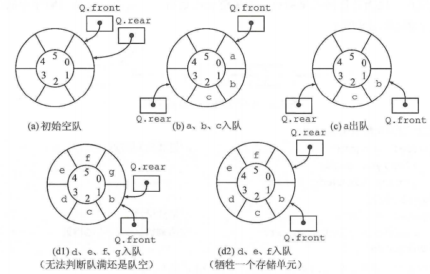

## 3.1 栈（Stack）

后进先出 LIFO -- Last In First Out

==n个不同元素进栈，出栈元素不同排列个数为 $C{n \atop 2n}/(n+1)$==

##### 栈的基本操作

```c++
InitStack(&S)
StackEmpty(S)
Push(&S,x)        // 指针+1，入栈
Pop(&S,&x)        // 出栈，指针-1
GetTop(S,&x)
DestoryStack(&S)  // 销毁栈并释放存储空间
```

### 栈的顺序存储结构  --  顺序栈

```c++
#define MaxSize 50  // 可能发生栈上溢
typedef struct{
	ElemType data[MaxSize];
	int top;       // 栈顶指针 -1为空 栈长：S.top+1
} SqStack;
```

指针有两种情况：指向栈顶元素 或指向栈顶元素的下一位置（栈顶+1），对应的入栈出栈操作也不同

#### 共享栈

栈空：top0 = -1  top2 = MaxSize

栈满：top1 - top0 = 1

更有效的利用存储空间，两个栈的空间相互调节，只有整个存储空间被占满才发生上溢，存取数据的时间复杂度仍为O(1)

### 栈的链式存储结构  --  链栈

便于多个栈共享存储空间 提高效率

采用（不带头结点的）单链表实现，所有操作都在表头进行

```
typedef struct Linknode{
	ElemType data;
	struct Linknode *next;
} *LiStack;
```

## 3.2 队列（Queue）

先进先出 FIFO -- First In First Out

##### 基本操作

```
InitQueue(&Q)
QueueEmpty(Q)
EnQueue(&Q,x)
DeQueue(&Q,&x)
GetHead(Q,&x)
```

### 队列的顺序存储结构

```c++
#define MaxSize 50 
typedef struct{
	ElemType data[MaxSize];
	int front,rear;
} SqQueue;
```

假溢出

#### 循环队列

似乎比较常考

通过模运算实现循环

```c++
Q.front = Q.rear = 0  // 初始条件
(Q.rear + 1)%MaxSize == Q.front  // 队满
Q.front = Q.rear // 队空
Q.front = (Q.front + 1) % MaxSize  // 队首进1，出栈
Q.rear = (Q.rear + 1) % MaxSize  // 队尾进1，入栈
(Q.rear - Q.front + MaxSize) % MaxSize // 队列长度
```



[循环队列的实现](./detail/3.2.2 循环队列的操作)

### 队列的链式存储结构 -- 链队列

同时带有队头指针和队尾指针的单链表

```c++
typedef struct{
	ElemType data;
    struct LinkNode *next;
}LinkNode;
typedef struct{
    LinkNode *front, *rear;
}LinkQueue;
```

将链式队列设计为**带头结点**和**头指针&尾指针**的**单链表**，以统一删除和插入操作

**头指针指向的是队头，方便出队的删除操作！**

```c++
Q.front = Q.rear = (LinkNode*)malloc(sizeof(LinkNode));
Q.front->next = NULL;

Q.front == Q.rear;  // 队空

LinkNode *p = Q.front->next;
x = Q.front->data;
Q.front->next = p->next;
if(Q.rear == p)
    Q.rear = Q.front;          // 若原队列中只有一个节点，删除后变空
free(p);
```

#### 双端队列

输出受限 & 输入受限

同时可以插入删除的一端，可以看作**栈**。另一端则看作队列。

通常仅判断序列是否满足题设条件，带入验证即可

## 3.3 栈和队列的应用

**栈**：`括号匹配`，`表达式求值`，`递归`，`函数调用`，`进制转换`，`迷宫求解`，`前序遍历二叉树`，`查找哈希表`，`图的深度优先搜索`

**队列**：`主机与外设速度不匹配`，`多用户资源竞争`，`页面替换算法(FIFO)`，`缓冲区`，`层次遍历(图的广度优先搜索、树的层序遍历`

##### 中缀表达式转化为后缀表达式

##### 栈在递归中的应用

效率低下，但代码简单、易于理解

将递归算法转换为非递归，**通常**需要借助栈

##### 队列在层次遍历 & 计算机系统 中的应用

## 3.4 特殊矩阵的压缩存储

一维数组

$LOC(a_i) = LOC(a_i) + i × L$

二维数组 （行下标与列下标范围[0,h~1~]，[0,h~2~]）

行优先 $LOC(a_{i,j}) = LOC(a_{i,j}) + [i× (h_{2}+1) + j] × L$

列优先 $LOC(a_{i,j}) = LOC(a_{i,j}) + [i× (h_{1}+1) + j] × L$

**对称矩阵**

数组长度：n(n+1)/2 + 1 

$k = \left\{\begin{matrix}
 \frac{i(i-1)}{2}+j-1,&i\geqslant j\\ 
 \frac{j(j-1)}{2}+i-1,&i<j
\end{matrix}\right.$

**三角矩阵**

数组长度：n(n+1)/2 + 2

下三角矩阵 $k = \left\{\begin{matrix}
 \frac{i(i-1)}{2}+j-1,&i\geqslant j\\ 
 \frac{n(n+1)}{2},&i<j
\end{matrix}\right.$

上三角矩阵 $k = \left\{\begin{matrix}
 \frac{(i-1)(2n-i+2)}{2}+j-i,&i\geqslant j\\ 
 \frac{n(n+1)}{2},&i<j
\end{matrix}\right.$

**三对角矩阵**(行优先方式)

数组长度：3n-2

$k = 2i+j-3$

$i=[(k+1)/3+1]$

$j=k-2i+3$

稀疏矩阵

三元组（行标，列标，值）既可以采用数组存储，也可以采用十字链表法存储

失去了随机存取特性

