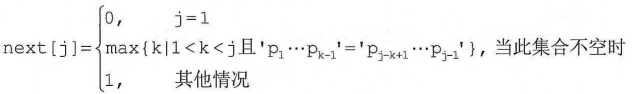

## 4.1 串（String）

#### 4.1.2 串的存储结构

1. 定长顺序存储表示
2. 堆分配存储表示
3. 块链存储表示

#### 4.1.3 串的基本操作

```
>StrAssign(&T,chars) 
 StrCopy(&T,S)
 StrEmpty(S)
>StrCompare(S,T) //S>T,返回值>0
>StrLength(S)
>SubString(&Sub,S,pos,len) //Sub返回S的第pos个字符起长度为len的子串
>Contact(&T,S1,S2)
 Index(S,T) // T在主串S中第一次出现的位置
 ClearString(&S)
 DestoryString(&S)
```

## 4.2 串的模式匹配

+ 暴力匹配

  最坏时间复杂度为O(mn)，实际执行时间近似为O(m+n)

+ [KMP及其优化算法](./detail/4.2.2 KMP算法及优化.md)
  
  + 时间复杂度为O(m+n)
  + next[j] 的含义是：在子串的第j个字符与主串发生失配时，则跳到子串的next[j]位置重新与主串当前位置进行比较
  + 
  + nextval[]: 出现p~j~=p~next[j]~,将next[j]修正为next[next[j]],直至不相等