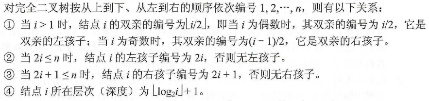

## 5.1 树的基本概念

树是一种递归的数据结构

树作为一种逻辑结构，同时也是一种分层结构

#### 5.1.2 基本术语

有序树 & 无序树，树的路径长度

森林、树可以是空

#### 5.1.3 [树的性质](./detail/5.1.3 树的性质的运算.md)

+ 树中的 结点数 = 所有结点的度数+1
+ 度为m的树中，第i层上至多有m^i-1^个结点（i≥1）
+ 高度为h的m叉树至多有(m^h^-1）/（m-1）个结点
+ 具有n个结点的m叉树的最小高度为「log~m~(n(m-1)+1)] 向上取整

结点与度之间的关系

+ 总结点数 = n~0~ + n~1~ + … + n~m~
+ 总分支数 = n~1~ + 2n~2~ + … + mn~m~
+ 总结点树 = 总分支数 + 1

## 5.2 二叉树的概念

度为2的树至少有3个结点，二叉树可以为空

##### 特殊二叉树

+ 满二叉树：高度为h，结点数为2^h^ - 1
+ 完全二叉树：
  + i ≤ n/2，则为分支节点
  + n为奇数，每个分支节点都有左右孩子，否则，n/2的结点只有左孩子
+ 二叉排序树
+ 平衡二叉树：左右子树深度之差不超过1

##### 二叉树的性质

+ n~0~ = n~2~ + 1
+ 第k层至多有2^k-1^个结点（非空）
+ 至多有2^h^ - 1 个结点
+ 

+ 结点数为n，高度为[log~2~(n+1)]向上取整 或 [log~2~n]+1 向下取整

#### 二叉树的储存结构

顺序存储：空间利用率低，适合满二叉树和完全二叉树

链式存储

+ 数据域data、左指针域lchild、右指针域rchild

  ```c
  typedef struct BiTNode{
  	ElemType data;
  	struct BiTNode *lchild,*rchild;
  }BiTNode,*BiTree;
  ```

+ 可以增加指向父节点的指针
+ **含有n个结点的二叉链表中，含有n+1个空链域**

## 5.3 二叉树的遍历和线索二叉树

#### 二叉树的遍历

**先序** NLR PreOrder

**中序** LNR InOrder

**后序** LRN PostOrder

+ 访问结点p时，栈中结点恰好是p的所有祖先，从栈底到栈顶结点再加上p结点，刚好构成从根节点到p结点的一条路径
+ 求根到某节点的路径、求两个结点的最近公共祖先

时间复杂度都是O(n)

递归与非递归算法

**层次遍历**

```c
void LevelOrder(BiTree T){
	InitQueue(Q);          // 初始化辅助队列
    BiTree p;
    EnQueue(Q,T);          // 根节点入队
    while(!IsEmpty(Q)){ 
        DeQueue(Q,p);      // 队头结点出队
        visit(p);
        if(p->lchild != null)
            EnQueue(Q,p->lchild);
        if(p->rchild != null)
            EnQueue(Q,p->rchild);
    }
}
```

**由遍历序列构造二叉树**

先序+后序不能唯一确定二叉树

#### 线索二叉树

传统的二叉链表中含有2n~0~ + n~1~个空指针域

引入线索二叉树是为了加快查找结点前驱和后继的速度

+ 若无左子树，lchild指向其前驱结点

+ 若无右子树，rchild指向其后继结点

+ 增加两个标志域标识指针域指向的内容

  + ltag：0 - 指向左孩子  1 - 指向前驱
  + rtag：0 - 指向有孩子  1 - 指向后继

+ ```c
  typedef struct ThreadNode{
  	ElemType data;
      struct ThreadNode *lchild,*rchild;
      int ltag,rtag;
  }ThreadNode,*ThreadTree;
  ```

**中序线索二叉树的构造**

线索化需要遍历一次二叉树

