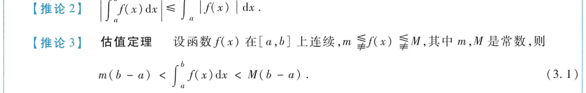

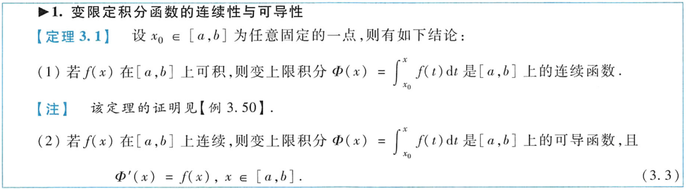

函数可导，导函数未必可积。函数可导只说明导函数有原函数，在本科高数的语境下，可积指黎曼可积，即黎曼和有极限，和被积函数有原函数是两码事。

可积但原函数不一定存在，原函数存在不一定可积

连续必有原函数，含无穷间断点一定不存在，震荡间断点有可能存在

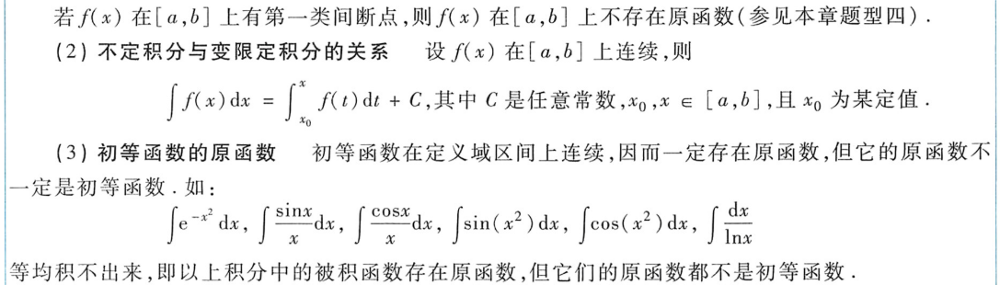

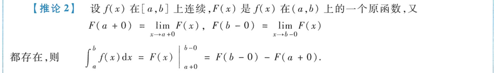

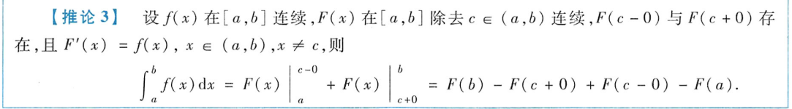

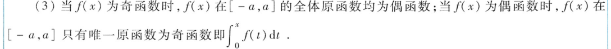

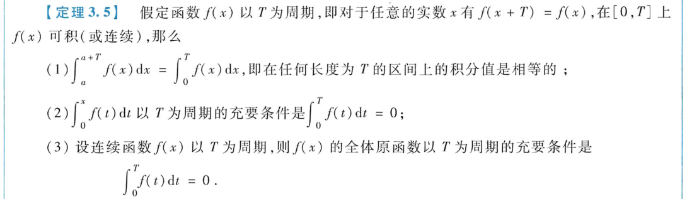

奇函数的偶次方是偶函数

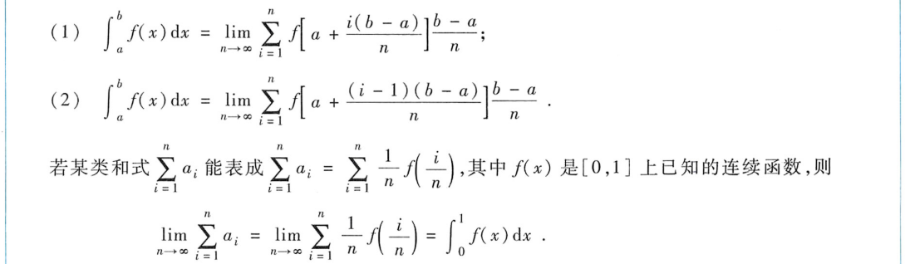

分母存在e^x^时，同除e^x^，或提出一个1，使分子分母都存在e^x^

分母是平方和的形式，可以考虑变成1+x^2^，然后用arctanx

看到对称区间要先考虑有没有奇函数或偶函数

求得原函数后（包含tanx），要看是否覆盖被积函数定义域

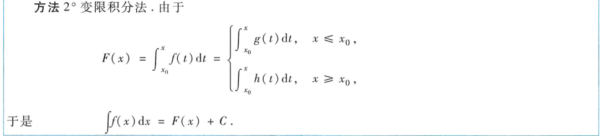

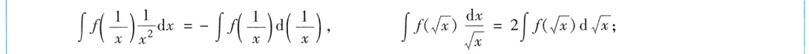

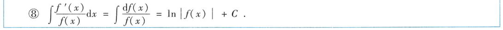

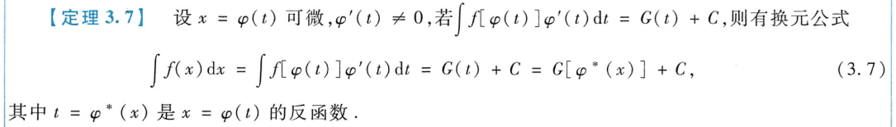

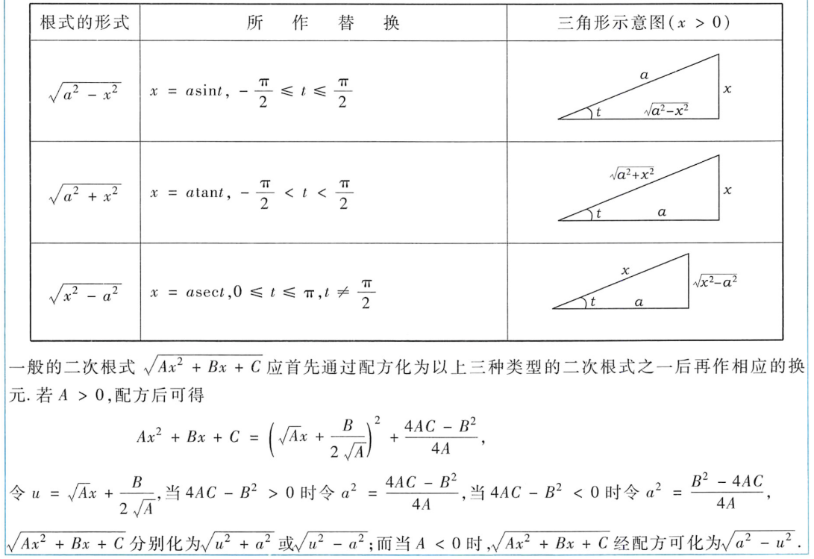

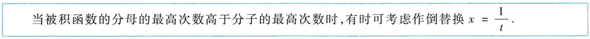

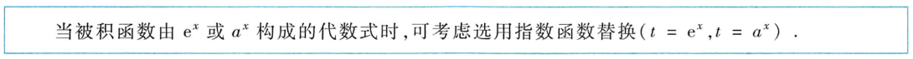

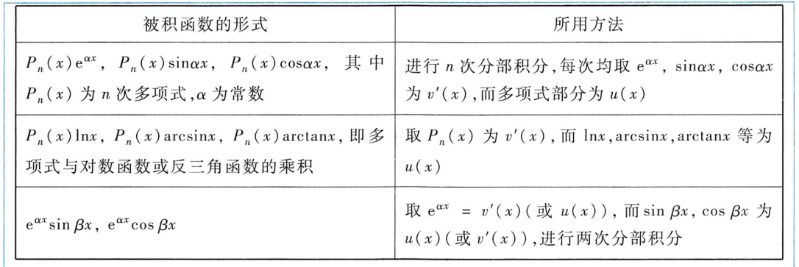

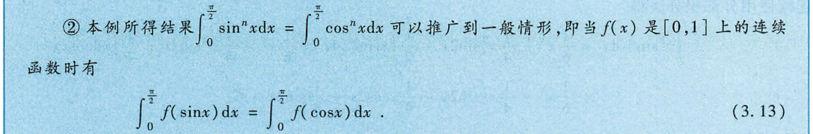

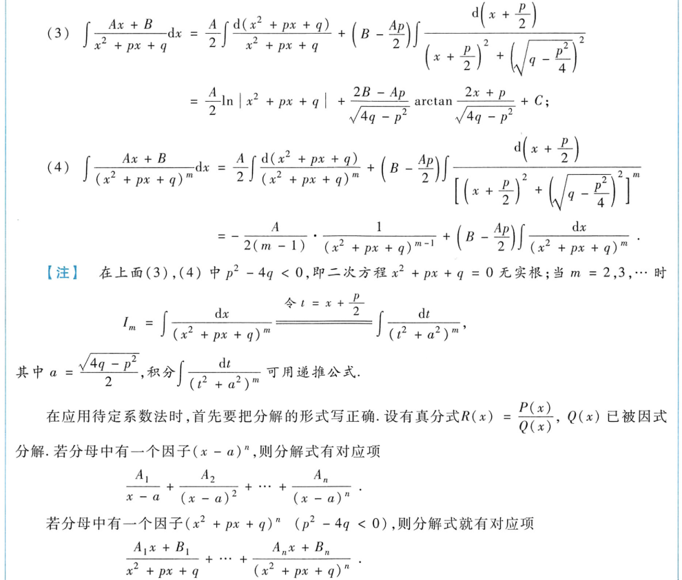

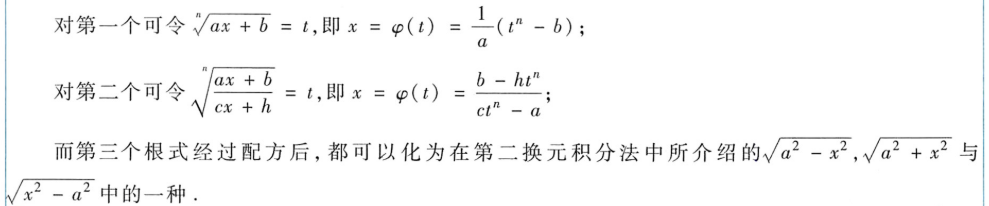

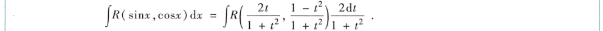

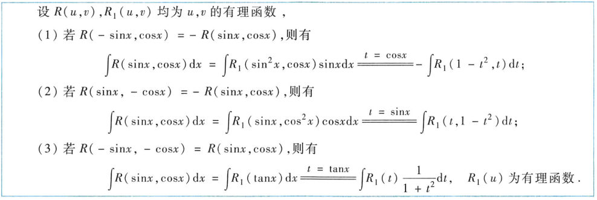

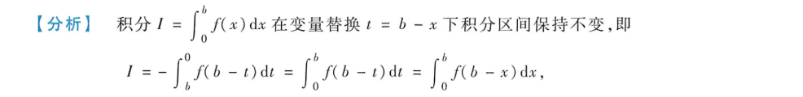

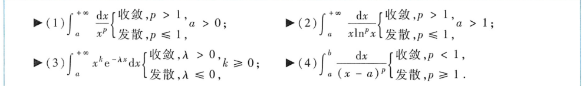

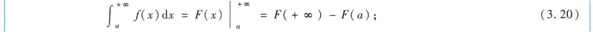

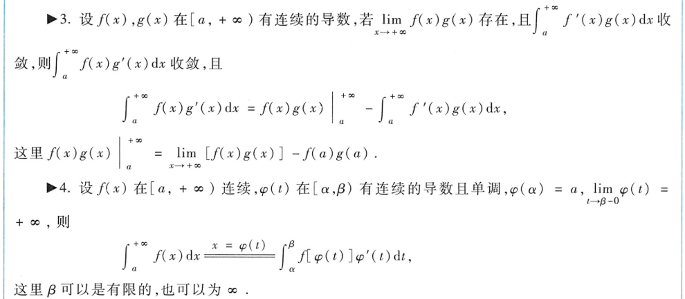

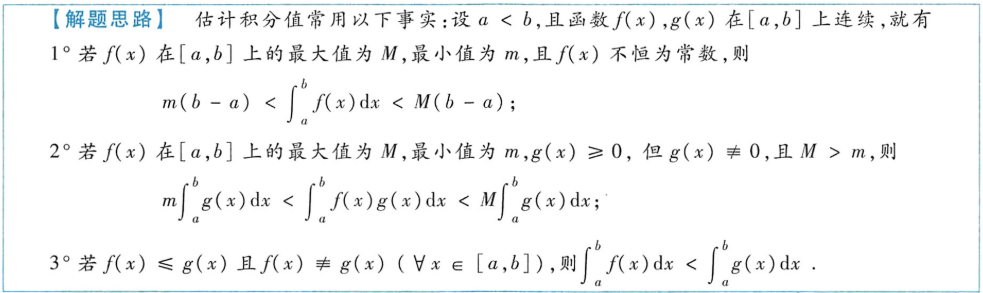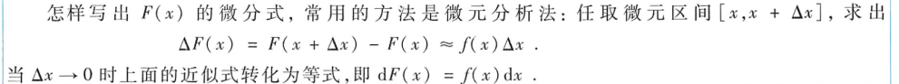

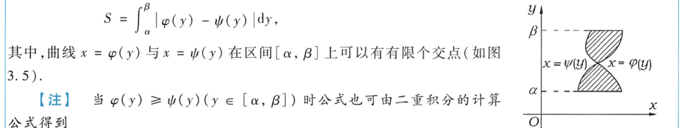

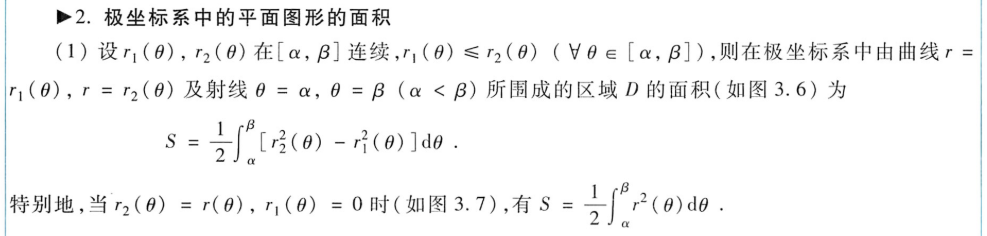

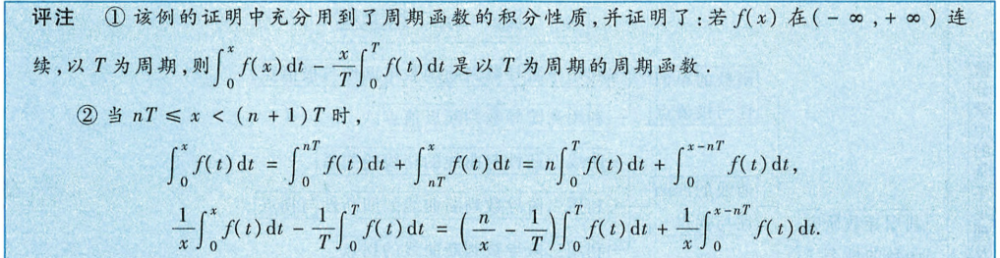

几种常用的曲线

